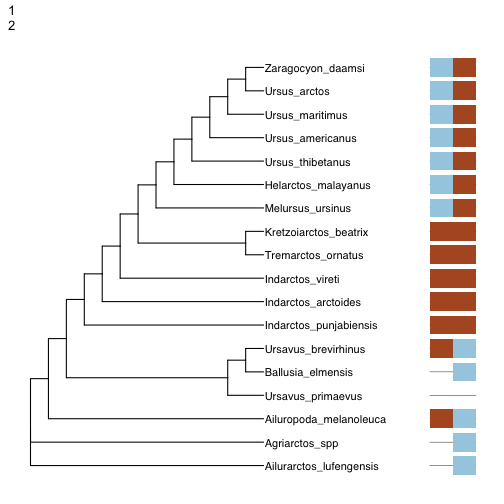
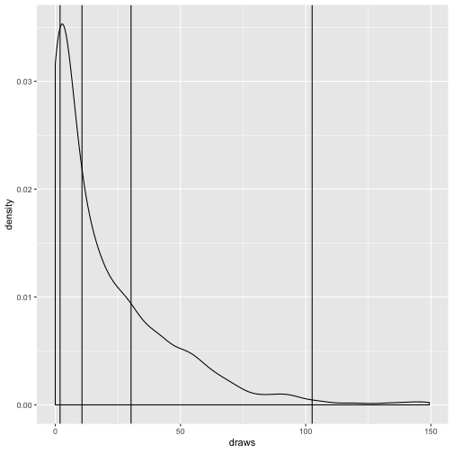
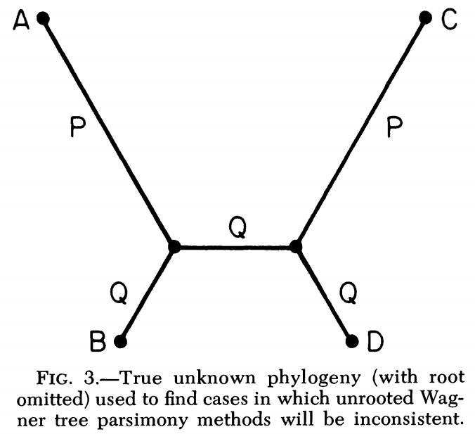
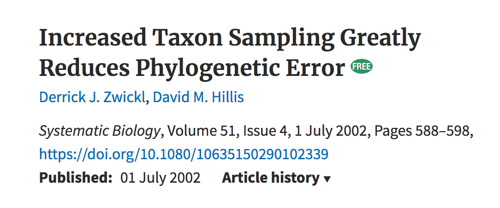
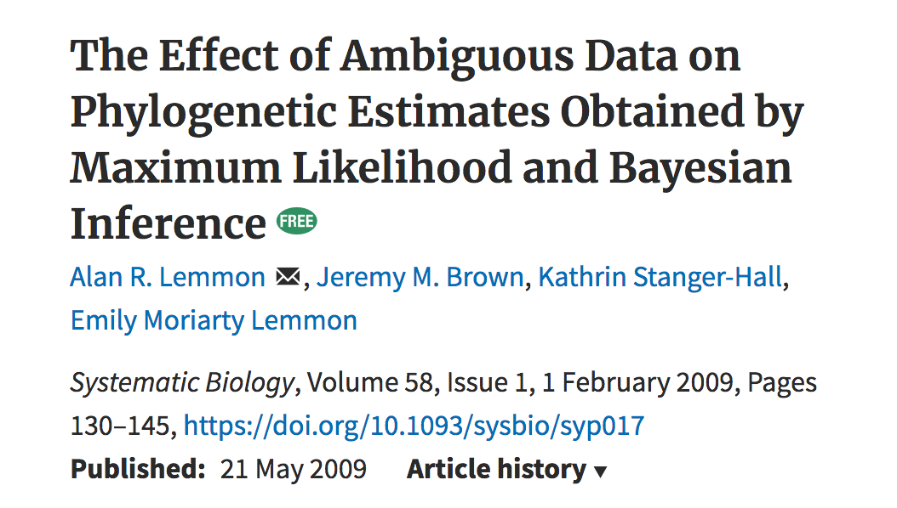
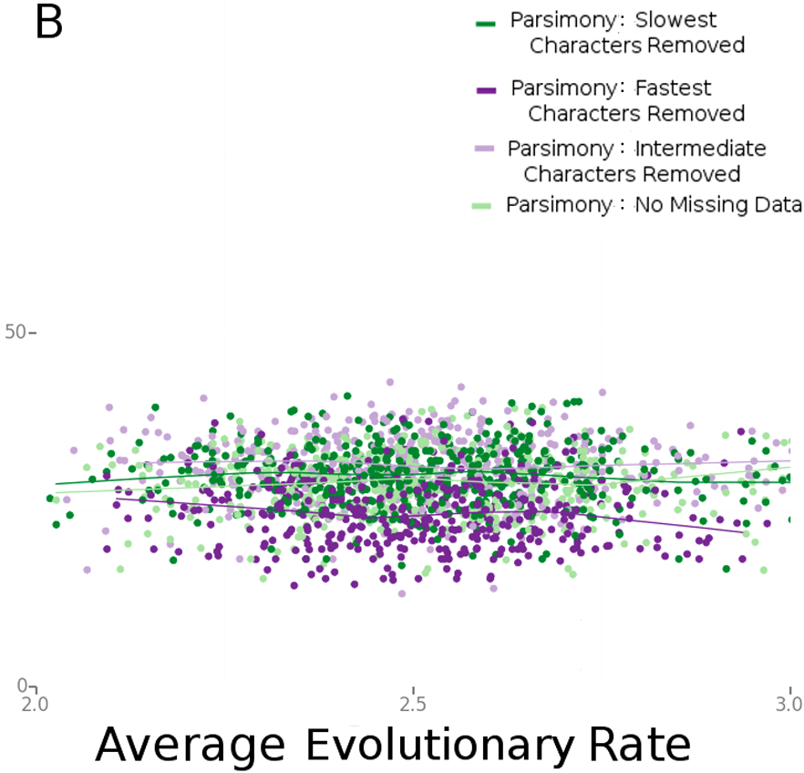

Bayesian Models
========================================================
author: April Wright
date: 08.09.2018
autosize: true

Dice Rolling Activity: AND
========================================================

Explain AND probability rule with dice roll

Dice Rolling Activity: AND
========================================================


```r
library(treesiftr)
library(alignfigR)
library(phangorn)
library(ggtree)
library(ggplot2)
aln_path <- "data/bears_fasta.fa"
bears <- read_alignment(aln_path)
tree <- read.tree("data/starting_tree.tre")

sample_df <- generate_sliding(bears, start_char = 1, stop_char = 2, steps = 1)
output_vector <- generate_tree_vis(sample_df = sample_df, alignment =                                         aln_path, tree = tree, phy_mat = bears)
```

```
Final p-score 2 after  0 nni operations 
Final p-score 2 after  0 nni operations 
```

Dice Rolling Activity: AND
========================================================

```r
output_vector[[1]]
```



Dice Rolling Activity: OR
========================================================

Explain OR probability rule with dice roll

Dice Rolling Activity: AND
========================================================

```r
output_vector[[1]]
```


Dice Rolling Activity: Independence 
========================================================

Assumed to be independent: Probability of events rolling a 1 and rolling a 2 both occurring, if they are independent under AND: 
## Pr(1,2) = Pr(1)Pr(2)

Dice Rolling Activity: Independence 
========================================================

Assumed to be independent: Probability of events rolling a 1 and rolling a 2 both occurring, if they are independent under AND: 
## Pr(1,2) = Pr(1)Pr(2)

- Do we expect that one dice roll is independent of the one prior to it?
- Do we assume the probability of observing a 0 state at a tip is independent of state 0 being at its parent node?
  - Does OR feel right for this situation?

Dice Rolling Activity: Non-Independence 
========================================================

When one outcome impacts the probability of the next outcome
- The joint probability: Pr(A,B)
- The probability of the first event: Pr(A)
- The probability of the second event given the first: Pr(A|B)

??? 
Should be noted that this is not that dissimiliar to parsimony, since a change because pruning algorithm

Dice Rolling Activity: Non-Independence 
========================================================

When one outcome impacts the probability of the next outcome
- The joint probability: Pr(A,B)
- The probability of the first event: Pr(A)
- The probability of the second event given the first: Pr(B|A)

## Pr(A,B) = Pr(A)Pr(B|A)

Dice Rolling Activity: Non-Independence 
========================================================

```r
output_vector[2]
```

```
[[1]]
```


Likelihood: How do we turn these terms into a model?
========================================================
- One way to think about likelihood is as a degree of surprise
  - Would you be surprised if you rolled ten 1s in a row?
  - When we calculate a likelihood, we search for a maximum likelihood - the value that minimizes the degree of surprise given the data

Likelihood: Model expectations  
========================================================  
  
| Roll  | Fair Die  | Loaded Die  |
|---|---|---|
| 1  | 1/6 |  2/6 |
| 2  |  1/6  |  1/6  |
| 3  |  1/6  |  1/6  |
| 4  |  1/6  |  1/6  |
| 5  |  1/6  |  1/6  |
| 6  |  1/6  |  0  |


Likelihood: Model expectations  
========================================================  
  
| Roll  | Fair Die  | Loaded Die  |
|---|---|---|
| 1  | __1/6__ |  2/6 |
| 2  | __1/6__ |  1/6  |
| 3  | __1/6__  |  1/6  |
| 4  |  __1/6__ |  1/6  |
| 5  |  __1/6__ |  1/6  |
| 6  |  __1/6__ |  0  |

==1

Probabilities for each model will sum to 1

Likelihood: Model expectations  
========================================================  

| Roll  | Fair Die  | Loaded Die  |
|---|---|---|
| 1  | 1/6 |  __2/6__  |
| 2  |  1/6  |  __1/6__   |
| 3  |  1/6  |  __1/6__  |
| 4  |  1/6  | __1/6__   |
| 5  |  1/6  | __1/6__   |
| 6  |  1/6  |  __0/6__  |

==1

Probabilities for each model will sum to 1

Likelihood: Model expectations  
========================================================  

| Roll  | Fair Die  | Loaded Die  |
|---|---|---|
| 1  | 1/6 |  __2/6__  |
| 2  |  1/6  |  __1/6__   |
| 3  |  1/6  |  __1/6__  |
| 4  |  1/6  | __1/6__   |
| 5  |  1/6  | __1/6__   |
| 6  |  1/6  |  __0/6__  |

==1

What would be the probability of rolling 5 sixes under the first model? 

Under the second?

Likelihood: The Mk Model 
========================================================  

- The main way morphological data is modeled in Bayesian and likelihood analysis is via the Mk model
- Assumptions:
  - Characters are always in one of _k_ states
  - Equally likely to transition to a state as from it
  - Changes can occur anywhere along the branch
  - Characters occur with equal frequency
  

Likelihood: The Mk Model 
========================================================  

- The main way morphological data is modeled in Bayesian and likelihood analysis is via the Mk model
- Assumptions:
  - Characters are always in one of _k_ states
  - Equally likely to transition to a state as from it
  - Changes can occur anywhere along the branch
  - Characters occur with equal frequency
  
- This, to me, is the crucial difference between likelihood-based phylogenetics and parsimony: the assumptions are explicit, they are mathematically represented, and they are _testable_


Likelihood: The Mk Model 
========================================================  

- The main way morphological data is modeled in Bayesian and likelihood analysis is via the Mk model
- Assumptions:
  - Equally likely to transition to a state as from it

Likelihood: The Mk Model 
========================================================  

- The main way morphological data is modeled in Bayesian and likelihood analysis is via the Mk model
- Assumptions:
  - Equally likely to transition to a state as from it

# L

Likelihood: The Mk Model 
========================================================  

- The main way morphological data is modeled in Bayesian and likelihood analysis is via the Mk model
- Assumptions:
  - Equally likely to transition to a state as from it

# L = [(1/2)]

Likelihood: The Mk Model 
========================================================  

- The main way morphological data is modeled in Bayesian and likelihood analysis is via the Mk model
- Assumptions:
  - Changes can occur anywhere along the branch

# L = [(1/2)(1/2 + (1/2e^(-2v/1)))]
in which v is the branch length

Likelihood: The Mk Model 
========================================================  

- Where do we get v from? 
v = substitution rate x time

Likelihood: The Mk Model 
========================================================  

- OK, cool
- How do we get the substitution rate?

Likelihood: The Mk Model 
========================================================  

- Let's say we start with a character, 0
  - We're going along a branch, and we have an event
  - We could ... have an event that results in no change (still 0)
  - We could ... have an event that results in change (to 1)
    - This is called a substitution
  
Likelihood: The Mk Model 
========================================================  

- There are only two possibilities for binary data - change or no change
- We often refer to the substitution rate as $\beta$
- The probability that any event happens, where it results in a change or not, is often called $\mu$. $\mu$ for binary data is 2*$\beta$

Likelihood: The Mk Model 
========================================================  

- The waiting time between substitutions is Poisson-Distributed


Likelihood: The Mk Model 
========================================================  

## - Pr(no events on branch) = e^(-$\mu$*t) 
## - Pr(something happens) = 1 - e^(-$\mu$*t) 
## - Pr(Any given event will cause us to change states) = 1/2
## - Pr(1 at tip | 0 at node) = (1/2)*1 - e^(-$\mu$*t) 
## - Pr(1 at tip | 0 at node) = (1/2)*1 - e^(-2$\beta$*t) 
    
Likelihood: The Mk Model 
========================================================  

Break: treesiftr 6-10  
    
    
Likelihood: Branch lengths 
========================================================  
## v is the number of substitutions per site    
## - ν = (1/2) $\mu$*t = 2$\beta$*t
## - v/2 = $\beta$*t

Likelihood: The Mk Model 
========================================================  

Break: http://phylo.bio.ku.edu/mephytis/tree-opt.html 
    

Likelihood: The Mk Model 
========================================================  

- The main way morphological data is modeled in Bayesian and likelihood analysis is via the Mk model
- Assumptions:
  - Characters occur with equal frequency
  
  
Likelihood: The Mk Model 
========================================================  

- The main way morphological data is modeled in Bayesian and likelihood analysis is via the Mk model
- Assumptions:
  - Characters occur with equal frequency
  - What is your probability of transitioning from 0 to 1 if all sites in your character matrix have 1 as their state?
  
  
Likelihood: The Mk Model 
========================================================  

- The main way morphological data is modeled in Bayesian and likelihood analysis is via the Mk model
- Assumptions:
  - Characters occur with equal frequency
  - What is your probability of transitioning from 0 to 1 if all sites in your character matrix have 1 as their state?  
  
## $\pi_{0}$ and $\pi_{1}$ 


## L = $\pi_{0}$[1/2 + (1/2e)^(2v/1)] 

This is just one branch and one character history!!!


  
Likelihood: The Mk Model 
======================================================== 


Likelihood: The Mk Model 
========================================================  

- The main way morphological data is modeled in Bayesian and likelihood analysis is via the Mk model
- Assumptions:
  - Characters are always in one of _k_ states
  - Equally likely to transition to a state as from it
  - Changes can occur anywhere along the branch
  - Characters occur with equal frequency

Likelihood: The Mk Model 
========================================================  

- The main way morphological data is modeled in Bayesian and likelihood analysis is via the Mk model
- Assumptions:
  - Characters are always in one of _k_ states
  - Equally likely to transition to a state as from it
  - Changes can occur anywhere along the branch
  - Characters occur with equal frequency

# Parsimony - minimmize the number of steps on a tree. Score trees according to their number of steps

Likelihood: The Mk Model 
========================================================  

- The main way morphological data is modeled in Bayesian and likelihood analysis is via the Mk model
- Assumptions:
  - Characters are always in one of _k_ states
  - Equally likely to transition to a state as from it
  - Changes can occur anywhere along the branch
  - Characters occur with equal frequency

# Parsimony - minimize the number of steps on a tree. Score trees according to their number of steps
# L = Pr(Data | Tree, Branch lengths, other model parameters)

Likelihood: The Mk Model 
========================================================  

-Much about the evolutionary process assumed to have generated the data is similar betwen Mk and parsimony 

-But also differences: under parsimony, every single character can have a different tree and length

Likelihood: Gamma-Distributed Rate Heterogeneity
======================================================== 

- Do you think all characters evolve at the same rate?
- Clarke and Middleton 2008 had a very nice exploration of this in birds


```r
library(dplyr)
dat <- data.frame(draws = c(rgamma(n = 500, shape = 2, scale = 10),rgamma(n = 500, shape = .5, scale = 10)))

d2 <- dat %>%  summarize(lower = quantile(dat$draws, probs = .25), middle = quantile(dat$draws, probs = .5), seventyfive = quantile(dat$draws, probs = .75), upper = quantile(dat$draws, probs = .99))

ggplot(dat, aes(x=draws)) + geom_density() + geom_vline(data = d2, aes(xintercept = lower)) + geom_vline(data = d2, aes(xintercept = middle)) +geom_vline(data = d2, aes(xintercept = seventyfive)) +geom_vline(data = d2, aes(xintercept = upper)) 
```



## Less spread == evolutionary rates among characters *more* similar


Likelihood: Gamma-Distributed Rate Heterogeneity
========================================================


Likelihood: The Mk Model vs. Parsimony
======================================================== 
- I hope I've communicated to you that there are a lot of commonalities between parsimony and the most commonly used model for morphology

Likelihood: The Mk Model vs. Parsimony
======================================================== 
- Because I published this


Likelihood: The Mk Model vs. Parsimony
======================================================== 
- You'll notice that parsimony really struggles when the evolutionary rate is high


Likelihood: The Mk Model vs. Parsimony
======================================================== 
- That's because of this - parsimony will always try to minimize homoplasy. Likelihood methods can model multiple changes (superimposed changes) along a branch.


Long-Branch Attraction
======================================================== 


A brief note on taxon sampling
======================================================== 



A brief note on missing data
======================================================== 

-Paleontological datasets tend to have a lot of missing data
  - In an analysis I did for Wright, Lloyd and Hillis (2016), I found most datasets falling in the 50-80% range
  
A brief note on missing data
======================================================== 
- According to some, missing data are no problem.


A brief note on missing data
======================================================== 
- According to some, missing data are no problem.


A brief note on missing data
======================================================== 
- According to others, it is



A brief note on missing data
======================================================== 
- Who is right? 

A brief note on missing data
======================================================== 
- Everyone, all at once


A brief note on missing data
======================================================== 
- Everyone, all at once





Bayesian Methods
=========================================================

- Can someone articulate for me a difference between a Bayesian method and a likelihood method?

Bayesian Methods
=========================================================

- Can someone articulate for me the difference between a Bayesian method and a likelihood method?


Priors
=========================================================
## Priors reflect _prior_ knowledge or work about a problem


Priors
=========================================================


Taking a Step Back
=========================================================


- What is the probability of a red head and yellow breast?  
- What is the probability of a red head and not-yellow breast?  
- What is the probability of a not-red head and yellow breast?  
- What is the probability of a not-red head and not-yellow breast?  


Joint Probabilities
=========================================================

## These are termed "joint" probabilities. 

- What is the probability of a red head and yellow breast?  
- What is the probability of a red head and not-yellow breast?  
- What is the probability of a not-red head and yellow breast?  
- What is the probability of a not-red head and not-yellow breast?  

Conditional Probabilities
=========================================================


- What is the probability that a manakin is yellow-breasted given that it is red-headed?  


Conditional Probabilities
=========================================================


- What is the probability that a manakin is yellow-breasted given that it is red-headed?  3/5

## This is the conditional probability

Conditional Probabilities
=========================================================


## This is the conditional probability
- It is the probability of yellow-beastedness given red-headedness,

## Pr(Y | R)( R )

Conditional Probabilities
=========================================================


## This is the conditional probability

## Equally, it could be Pr(R | Y)(Y)


Conditional Probabilities
=========================================================


## This is the conditional probability
- It is the probability of yellow-beastedness given red-headedness,  

## Pr(Y | R)( R )

Conditional Probabilities
=========================================================


## This is the conditional probability

# $\frac{(Pr(R | Y)Pr(Y))}{Pr(Y)}$ = $\frac{(Pr(Y | R)Pr( R ))}{Pr(Y)}$

Marginal Probabilities
=========================================================


- What is the probability that a manakin is yellow-breasted?

Marginal Probabilities
=========================================================


- What is the probability that a manakin is yellow-breasted? 4/7

## This is a marginal probability

Marginal Probabilities
=========================================================


- What is the probability that a manakin is yellow-breasted? 4/7

## This is a marginal probability

## Pr(Y) = Pr(Y, R) + Pr(Y, B)


Marginal Probabilities
=========================================================


- What is the probability that a manakin is yellow-breasted? 4/7

## This is a marginal probability

## Pr(Y) = Pr(Y, R) + Pr(Y, B)

## We'll be coming back to this in a moment

Bayes Rule
=========================================================

How do we calculate joint probabilities in a Bayesian context:

# Pr(R|Y) Pr(Y) = Pr(Y|R) Pr( R )

Bayes Rule
=========================================================

# If we divide byth sides by Pr(Y), we can simplify the statement 

# $\frac{(Pr(R | Y)Pr(Y))}{Pr(Y)}$ = $\frac{(Pr(Y | R)Pr( R ))}{Pr(Y)}$

# Simplifies to: 

# Pr(R|Y) = $\frac{(Pr(Y | R)Pr( R ))}{Pr(Y)}$

Bayes Rule
=========================================================
# $\frac{(Pr(R | Y)Pr(Y))}{Pr(Y)}$ = $\frac{(Pr(Y | R)Pr( R ))}{Pr(Y)}$

# Simplifies to: 

# _Pr(R|Y)_ = $\frac{(Pr(Y | R)Pr( R ))}{Pr(Y)}$

# Posterior Probability of red-headedness

Bayes Rule
=========================================================
# $\frac{(Pr(R | Y)Pr(Y))}{Pr(Y)}$ = $\frac{(Pr(Y | R)Pr( R ))}{Pr(Y)}$

#Simplifies to: 

# Pr(R|Y) = $\frac{(Pr(Y | R) Pr( R ))}{Pr(Y)}$

# Likelihood of Red-headed given Yellow-breasted

Bayes Rule
=========================================================
# $\frac{(Pr(R | Y)Pr(Y))}{Pr(Y)}$ = $\frac{(Pr(Y | R)Pr( R ))}{Pr(Y)}$

# Simplifies to: 

# Pr(R|Y) = $\frac{(Pr(Y | R)  Pr( R ))}{Pr(Y)}$

# Marginal likelihood of being yellow-breasted


Bayes Rule
=========================================================
# $\frac{(Pr(R | Y)Pr(Y))}{Pr(Y)}$ = $\frac{(Pr(Y | R)Pr( R ))}{Pr(Y)}$

# Simplifies to: 

# Pr(R|Y) = $\frac{(Pr(Y | R)  Pr( R ))}{Pr(Y)}$

# Prior probability of red-headedness

Priors
=========================================================
## Priors reflect _prior_ knowledge or work about a problem

# A prior can always be overcome by strong evidence

Bayes Rule
=========================================================
In practice

# Pr(Model Hypothesis | Data) = 

# $\frac{(Pr(Data | Model Hypothesis)  Pr( Model Hypothesis ))}{Pr(Data)}$

# Pr(Data) derived via heuristics

Tree Searching Under ML and Bayesian Analyses
================================================


- We've covered that it is not practical to brute-force search trees
- We've covered some heuristics
- Parsimony heuristics can be simple - we are simply varying the topology
  - What happens when we need to vary topology, branch lengths and a bunch of model parameters?
  
MCMC
================================================
## Markov Chain Monte Carlo
- This sounds intimidating, but let's break it down a little bit
  - Markov chain: Memoryless process
  - Monte Carlo: Random proposals

MCMC
================================================
## Markov Chain Monte Carlo
- This sounds intimidating, but let's break it down a little bit
  - Markov chain: Memoryless process
  - Monte Carlo: Random proposals

## Put it together: we start with some value for a parameter, and make changes to it stoachstically. Then, we evaluate the likelihood score of that new parameter. If it is good, we keep it. If it is bad, we chuck it. 

MCMC
================================================
## Put it together: we start with some value for a parameter, and make changes to it stoachstically. Then, we evaluate the likelihood score of that new parameter. If it is good, we use it to seed future searches. If it is bad, we keep our current value.

- Where does the lack of memory come in? And why is that a good thing?

MCMC
================================================

```rev
for (i in 1:nbr){
    br_lens[i] ~ dnExponential(br_len_lambda)
    moves[mvi++] = mvScale(br_lens[i]) 
}
```

Let's think about this in plain language.
- Assign a length of each branch (drawn from a gamma)
- Choose how the parameter will be changed (by scaling)

MCMC
================================================

```rev
for (i in 1:nbr){
    br_lens[i] ~ dnExponential(br_len_lambda)
    moves[mvi++] = mvScale(br_lens[i]) 
}
```

Let's think about this in plain language.
- Assign a length of each branch (drawn from a gamma)
- Choose how the parameter will be changed (by scaling)
- A solution that is good will be hit many times


MCMC
================================================

```rev
tau ~ dnUniformTopology(names)
moves[mvi++] = mvNNI(tau, weight=2*nbr)
phylogeny := treeAssembly(tau, br_lens)
moves[mvi++] = mvSPR(tau, weight=nbr)

```

Let's think about this in plain language.
- Build an initial tree
- Change it via SPR and NNI
- What is the idea of weight?

MCMC
================================================
- Under ML: We use this to try to find a set of parameters that gives us the best model likelihood.
- Under Bayesian: We use this to obtain a sample of models and parameters that show us the range of solutions for our data


Bayes Rule
=========================================================

Hands On: Rev basics

Hands On: RB_Discrete_morphology, using priors to relax Mk assumptions

Hands On: RB_Discrete_morphology, analyzing the output
Priors
=========================================================
## Priors reflect _prior_ knowledge or work about a problem

We, for example, know that it is not incredibly likely to have super long branch lengths. Let's look at that branch length prior again:


```rev
for (i in 1:nbr){
    br_lens[i] ~ dnExponential(br_len_lambda)
    moves[mvi++] = mvScale(br_lens[i]) 
}
```

