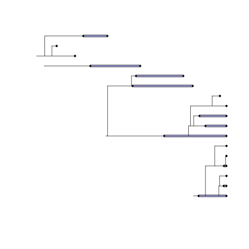
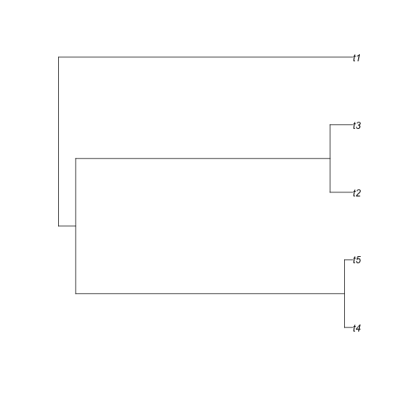

DivTime
========================================================
author: April Wright
date: 08.10.2018
autosize: true

Yesterday, we unveiled a conflation
========================================================

Likelihood and Bayesian phylogenetic trees have a rate-based branch length

# distance =  rate x time

What if we're interested in time?


Why are we interested in time?
========================================================

- Time might be inherently interesting.


Why are we interested in time?
========================================================

- Time might be inherently interesting
- Time might tell us something interesting about natural history


Why are we interested in time?
========================================================

- Time might be inherently interesting
- Time might tell us something interesting about natural history
- Time might be required to test hypotheses 


Divergence time estimation
========================================================
- Strict clock


```r
library(phytools)
plot(pbtree(n = 5))
```


If we know the rate of sequence divergence is 0.5% per million years, we can date the tree by extrapolating from the amount of divergence.

Branch Rates
========================================================
- Strict clock


```r
library(phytools)
plot(pbtree(n = 5))
```



Reality: the rate at which mutations arise varies based on generation time, lifestyle, DNA repair. Evolutionary forces cause differences in if a mutation is fixed, or removed from the population.


Branch Rates
========================================================
- Strict clock

```r
library(phytools)
plot(pbtree(n = 5))
```


Reality: the rate at which mutations arise varies based on generation time, lifestyle, DNA repair. Evolutionary forces cause differences in if a mutation is fixed, or removed from the population.

And what is a morphological "mutation?" How does this apply to fossils?

Branch Rates
========================================================
- Strict clock


Reality: the rate at which mutations arise varies based on generation time, lifestyle, DNA repair. Evolutionary forces cause differences in if a mutation is fixed, or removed from the population.

Branch Rates
========================================================
- Relaxed clock

```r
library(phytools)
pb <- pbtree(n = 5)
branches <- (length(pb$tip.label)*2) - 2
rates <- rexp(n = branches, rate = 1)
pb$edge.length <- rates
plotBranchbyTrait(pb, rates, mode = "edges")
```


Branch Rates
========================================================
- Relaxed clock


Branch Rates
========================================================
## Many ways to describe how branch rates are distributed

- Global clock (Zuckerkandl & Pauling, 1962)
- Uncorrelated/independent rates models (Drummond et al. 2006;
Rannala & Yang 2007; Lepage et al. 2007)
- Log-normally distributed autocorrelated rates (Thorne, Kishino &
Painter 1998; Kishino, Thorne & Bruno 2001; Thorne & Kishino 2002)
- Local clocks (Hasegawa, Kishino & Yano 1989; Kishino & Hasegawa 1990; Yoder & Yang 2000; Yang & Yoder 2003, Drummond and Suchard 2010)
- Mixture models on branch rates (Heath, Holder, Huelsenbeck 2012)
- Punctuated rate change model (Huelsenbeck, Larget and Swoford 2000)

Slide from Rachel Warnock

Tree Models
========================================================
## We also need a model that describes the tree - and particularly, the distribution of nodes on the tree

### We will use the fossilized birth-death model (Stadler 2010) for this 

- This model has been available for divergence time estimation since Heath et al. 2014

Tree Models
========================================================
- The FBD is a macroevolutionary model, which has several key parameters

Tree Models
========================================================
- The FBD is a macroevolutionary model, which has several key parameters


Tree Models
========================================================
- The FBD is a macroevolutionary model, which has several key parameters


Tree Models
========================================================
- The FBD is a macroevolutionary model, which has several key parameters


Tree Models
========================================================
- The FBD is a macroevolutionary model, which has several key parameters


Tree Models
========================================================
- The FBD is a macroevolutionary model, which has several key parameters


Information in a phylogenetic matrix
========================================================
- Does this tell you when (in absolute time) _Agriarctos spp_ diverged from _Ailurarctos lufengensis_? 

```r
library(treesiftr)
data(bears)
bears[1:4]
```

```
$Agriarctos_spp
 [1] "?" "0" "?" "?" "?" "?" "?" "?" "?" "?" "?" "?" "?" "?" "?" "?" "0"
[18] "0" "0" "1" "1" "1" "1" "0" "0" "1" "?" "1" "1" "?" "0" "1" "1" "1"
[35] "1" "0" "1" "1" "0" "?" "?" "0" "1" "1" "1" "0" "?" "?" "?" "?" "?"
[52] "?" "?" "?" "?" "?" "?" "?" "?" "?" "?" "?"

$Ailurarctos_lufengensis
 [1] "?" "0" "?" "?" "?" "?" "?" "?" "?" "?" "?" "?" "?" "?" "?" "?" "?"
[18] "0" "0" "1" "1" "1" "1" "0" "1" "1" "?" "1" "1" "?" "0" "?" "?" "?"
[35] "?" "0" "1" "1" "1" "?" "0" "0" "1" "1" "1" "0" "1" "0" "1" "1" "0"
[52] "1" "1" "?" "?" "?" "?" "?" "?" "?" "?" "?"

$Ailuropoda_melanoleuca
 [1] "1" "0" "1" "1" "1" "1" "0" "1" "1" "0" "1" "0" "0" "1" "0" "0" "0"
[18] "0" "0" "1" "1" "1" "1" "0" "1" "0" "1" "1" "1" "0" "0" "1" "0" "1"
[35] "0" "0" "1" "1" "0" "0" "0" "0" "1" "1" "1" "0" "1" "0" "0" "1" "0"
[52] "1" "1" "0" "0" "0" "1" "0" "0" "0" "1" "0"

$Ballusia_elmensis
 [1] "?" "0" "?" "?" "?" "?" "0" "1" "?" "0" "0" "0" "0" "0" "0" "0" "0"
[18] "0" "?" "0" "1" "0" "0" "0" "0" "0" "?" "1" "0" "0" "0" "0" "1" "0"
[35] "0" "?" "?" "0" "?" "?" "?" "0" "0" "0" "0" "0" "1" "0" "1" "1" "1"
[52] "1" "0" "?" "?" "?" "?" "?" "?" "?" "?" "?"
```
# No. 

Information in a phylogenetic matrix
========================================================
- Where do we get our information on absolute ages?

```r
library(treesiftr)
data(bears)
bears[1:4]
```

```
$Agriarctos_spp
 [1] "?" "0" "?" "?" "?" "?" "?" "?" "?" "?" "?" "?" "?" "?" "?" "?" "0"
[18] "0" "0" "1" "1" "1" "1" "0" "0" "1" "?" "1" "1" "?" "0" "1" "1" "1"
[35] "1" "0" "1" "1" "0" "?" "?" "0" "1" "1" "1" "0" "?" "?" "?" "?" "?"
[52] "?" "?" "?" "?" "?" "?" "?" "?" "?" "?" "?"

$Ailurarctos_lufengensis
 [1] "?" "0" "?" "?" "?" "?" "?" "?" "?" "?" "?" "?" "?" "?" "?" "?" "?"
[18] "0" "0" "1" "1" "1" "1" "0" "1" "1" "?" "1" "1" "?" "0" "?" "?" "?"
[35] "?" "0" "1" "1" "1" "?" "0" "0" "1" "1" "1" "0" "1" "0" "1" "1" "0"
[52] "1" "1" "?" "?" "?" "?" "?" "?" "?" "?" "?"

$Ailuropoda_melanoleuca
 [1] "1" "0" "1" "1" "1" "1" "0" "1" "1" "0" "1" "0" "0" "1" "0" "0" "0"
[18] "0" "0" "1" "1" "1" "1" "0" "1" "0" "1" "1" "1" "0" "0" "1" "0" "1"
[35] "0" "0" "1" "1" "0" "0" "0" "0" "1" "1" "1" "0" "1" "0" "0" "1" "0"
[52] "1" "1" "0" "0" "0" "1" "0" "0" "0" "1" "0"

$Ballusia_elmensis
 [1] "?" "0" "?" "?" "?" "?" "0" "1" "?" "0" "0" "0" "0" "0" "0" "0" "0"
[18] "0" "?" "0" "1" "0" "0" "0" "0" "0" "?" "1" "0" "0" "0" "0" "1" "0"
[35] "0" "?" "?" "0" "?" "?" "?" "0" "0" "0" "0" "0" "1" "0" "1" "1" "1"
[52] "1" "0" "?" "?" "?" "?" "?" "?" "?" "?" "?"
```
