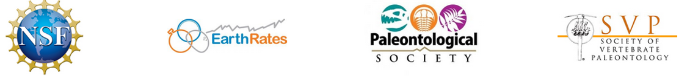

# APB2017

These materials can be installed as an R package:

```
devtools::install_github("wrightaprilm/APB2018")
```

Slides are meant to be rendered in RStudio.


# Schedule

## Day One
| Item | Time |
|------|------|
| Intro & begin installs | 9 - 9:30 |
| About Me | 9:30 - 9:45 | 
| Intro to Phylogenetic Data | 9:45 - 10:30 |
| Break | 10:30 - 10:45 |
| [Phylogenetic Data Hands On](https://wrightaprilm.github.io/treesiftr/articles/02-treesiftr-advanced.html) | 10:45 - Noon |
| Lunch | 12 - 1 | 
| [Tree Thinking I](https://github.com/wrightaprilm/APB2018/blob/master/TreeThinking.Rmd.Rpres) | 1 - 2:30 | 
| Break | 2:30 - 2:45 | 
| [Tree Thinking II](https://github.com/wrightaprilm/APB2018/blob/master/TreeThinking.Rmd.Rpres) | 2:45-5 | 


## Day Two
| Item | Time |
|------|------|
| [Introduction to Bayesian Models](https://github.com/wrightaprilm/APB2018/blob/master/BayesianModels.Rpres) | 9 - 10:30 |
| Break | 10:30 - 10:45 |
| [Models and reality](https://github.com/wrightaprilm/APB2018/blob/master/RelaxedPriorMotivation.Rpres) | 10:45 - Noon |
| Lunch | 12 - 1 | 
| Graphical models, on board exercise | 1 - 2:30 | 
| Break | 2:30 - 2:45 | 
| [RevBayes Dicrete Morphology](https://wrightaprilm.github.io/APB2018/articles/RB_Discrete_Morphology/RB_Discrete_Morphology_Tutorial.html) | 2:45-5 | 

## Day Three
| Item | Time |
|------|------|
| [Introduction to Divergence Time Estimation](https://github.com/wrightaprilm/APB2018/blob/master/DivTime.Rpres) | 9 - 10:30 |
| Break | 10:30 - 10:45 |
| [Continued: Div Time Exercise](https://wrightaprilm.github.io/APB2018/articles/R_exercises/03-FossilSim.html) | 10:45 - Noon |
| Lunch | 12 - 1 | 
| [RevBayes FBD](https://wrightaprilm.github.io/APB2018/articles/RB_Total_Evidence/RB_Total_Evidence_Tutorial.html) | 1 - 2:30 | 
| Break | 2:30 - 2:45 | 
| Finish RevBayes Div Time | 2:45-5 | 


__Comments/Questions/Corrections:__ April Wright (april.wright@selu.edu)

__Peer-review:__ This document is pre-review.

__Note:__ This tutorial may be expanded or revised after peer-review process has been completed. The author is responsible for all conceptual and scripting errors in the current version of this document.

__Our Sponsors:__
_National Science Foundation (Sedimentary Geology and Paleobiology Program)_, _National Science Foundation (Earth Rates Initiative)_, _Paleontological Society_, _Society of Vertebrate Paleontology_
 
 

