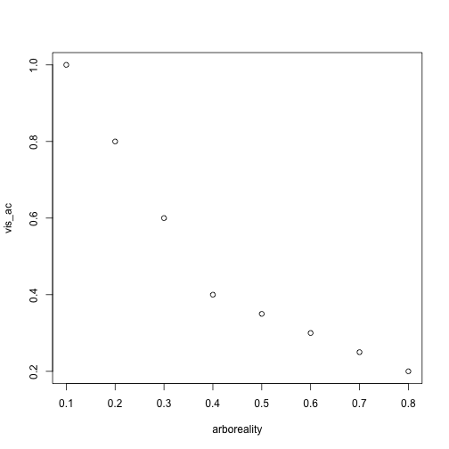
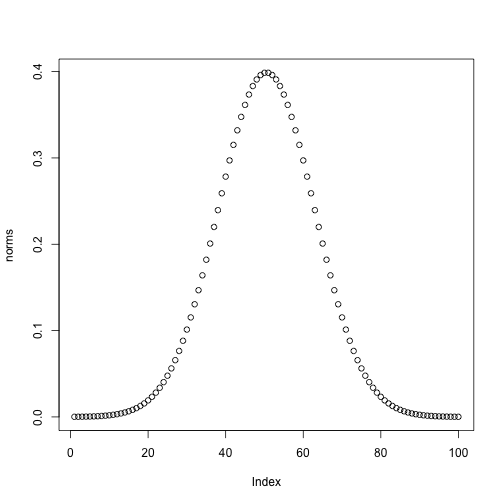
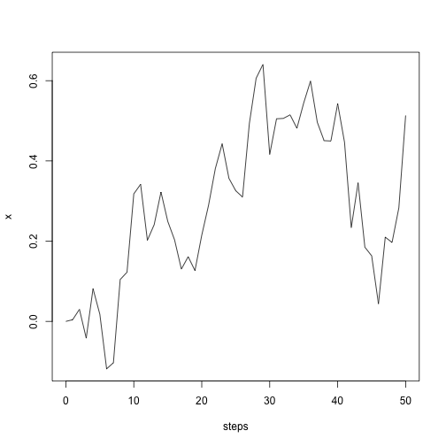
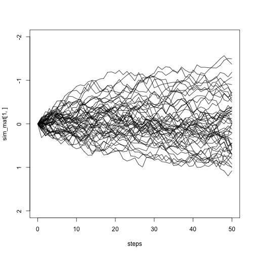
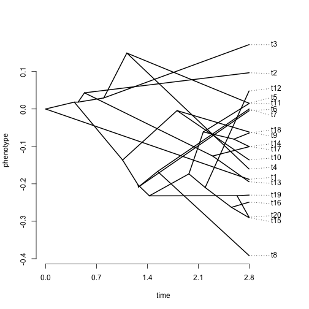
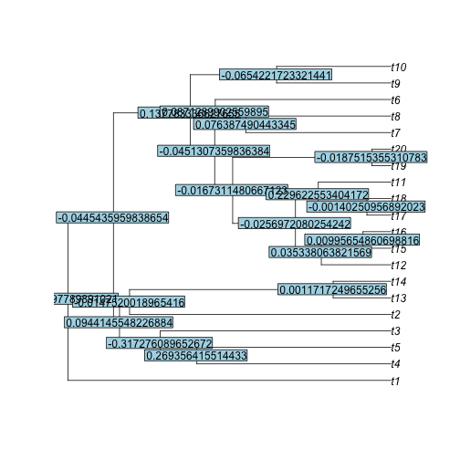
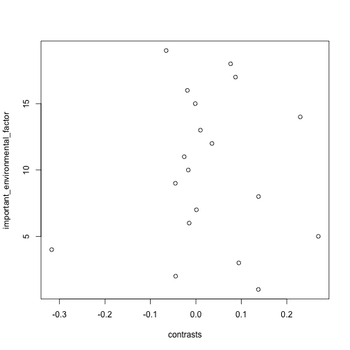

Comparative Methods
========================================================
author: April Wright  
date: 8.11.18
autosize: true

We've talked about
========================================================

- Estimating phylogenetic trees
- Estimating divergence times

## Now let's talk about using trees to understand trait evolution

Using trees to understand trait evolution
========================================================

- What is a phylogeny?
  - A model of evolutionary history
  - Speciation and extinction
  - Rates of evolution
  - (Maybe) absolute time


Using trees to understand trait evolution
========================================================

- But there are also special challenges to using phylogenetic trees to study the evolutionary history of traits

Linear Regression
========================================================

Let's say that in your group of organisms, you believe that arboreality is associated with lower visual acuity. 


Linear Regression
========================================================

Let's say that in your group of organisms, you believe that arboreality is associated with lower visual acuity. 


```r
arboreality <- c(.1, .2, .3, .4, .5, .6, .7, .8)
vis_ac <- c(1, .8, .6, .4, .35, .3, .25, .2)
plot(arboreality, vis_ac)
```


Linear Regression
========================================================
What is the problem with what we've done? 


```r
arboreality <- c(.1, .2, .3, .4, .5, .6, .7, .8)
vis_ac <- c(1, .8, .6, .4, .35, .3, .25, .2)
plot(arboreality, vis_ac)
```




Linear Regression
========================================================
What is the problem with what we've done? 


```r
arboreality <- c(.1, .2, .3, .4, .5, .6, .7, .8)
vis_ac <- c(1, .8, .6, .4, .35, .3, .25, .2)
plot(arboreality, vis_ac)
```


These are not independent datapoints!


Linear Regression
========================================================
What is the problem with what we've done? 


These are not independent datapoints!

Linear Regression
========================================================
What is the problem with what we've done? 


These are not independent datapoints!

Linear Regression
========================================================
Does this mean we simply can't make these comparsions?

Linear Regression
========================================================
Does this mean we simply can't make these comparsions?

No! But we _must_ account for the effect of shared heritage.

Brownian Motion
========================================================

- Based on the random movement of particles in fluid

- The idea is that sucessive movements are independent of each other.

Brownian Motion
========================================================

- Under this model, traits evolve due to a continuous random walk. 

- The difference (contrast) between the traits possessed by any two tips on the tree will be normally distributed. The mean of the normal will be 0, and the variance will be proportional to the time since common ancestor. 

Brownian Motion
========================================================

- Under this model, traits evolve due to a continuous random walk. 

- The difference (contrast) between the traits possessed by any two tips on the tree will be normally distributed. The mean of the normal will be 0, and the variance will be proportional to the time since common ancestor. 

Brownian Motion
========================================================

- The difference (contrast) between the traits possessed by any two tips on the tree will be normally distributed. The mean of the normal will be 0, and the variance will be proportional to the time since common ancestor. 


```r
x <- seq(-4, 4, length=100)
norms <- dnorm(x, sd = 1)
plot(norms)
```



Brownian Motion
========================================================

```r
steps <- 0:50  
var <- 0.01
x <- rnorm(n = length(steps) - 1, sd = sqrt(var))
x <- c(0, cumsum(x))
plot(steps, x, type = "line")
```



Brownian Motion
========================================================

```r
steps <- 0:50  
var <- 0.01
n_sims <- 50
sim_mat <- matrix(0, n_sims, length(steps))


for (i in 1:n_sims) {
  sim_mat[i, ] <- c(0, cumsum(rnorm(n = length(steps) - 1, sd = sqrt(var))))
}

plot(steps, sim_mat[1, ], type = "line", ylim = c(2, -2)) #when you scale var, you may need to adjust the axis!

for (i in 1:n_sims) {
  lines(steps, sim_mat[i, ])
}
```




Phylogenetically Independent Contrasts
========================================================


1, 2, 3, 4 are not independent. But the difference between 1 & 2 is independent of the difference between 3 & 4.

Phylogenetically Independent Contrasts
========================================================


Phylogenetically Independent Contrasts
========================================================


Contrasts usually standardized by the variance

Brownian Motion on a Tree
========================================================


```r
library(phytools)
tree <- pbtree(n=20)
x <- fastBM(tree, sig2 = var, internal = TRUE)
x
```

```
           t1           t17           t18           t11           t13 
 0.1804656105 -0.0503182760 -0.0005755363 -0.0894360233  0.0506325911 
          t14           t12            t5            t6            t8 
-0.1073983482 -0.1337667179 -0.1335245402 -0.1119503810 -0.0827241442 
           t9            t7           t19           t20            t3 
-0.1694218468 -0.2049602085  0.1417388706  0.1536287565  0.1291619244 
           t4           t15           t16           t10            t2 
 0.0423260933 -0.0037916848 -0.0465976582 -0.0130055547  0.0094411778 
           21            22            23            24            25 
 0.0000000000  0.0255720730  0.0244512769  0.0124346490  0.0088034808 
           26            27            28            29            30 
-0.0244751758 -0.0337037891 -0.0424909730 -0.0514336379 -0.0345001128 
           31            32            33            34            35 
 0.0009092648 -0.0311083534 -0.0507616520  0.0314824758  0.1592093538 
           36            37            38            39 
 0.0273608536 -0.0078714075 -0.0158045672 -0.0689625703 
```

Brownian Motion on a Tree
========================================================


```r
library(phytools)
tree <- pbtree(n=20)
x <- fastBM(tree, sig2 = var, internal = TRUE)
phenogram(tree, x)
```



Brownian Motion on a Tree
========================================================


```r
x <- fastBM(tree, sig2 = var, internal = FALSE)
contrasts <- pic(x, tree, scaled=FALSE)
contrasts
```

```
          21           22           23           24           25 
 0.137397790 -0.044543596  0.094414555 -0.317276090  0.269356416 
          26           27           28           29           30 
-0.014752002  0.001171725  0.137783337 -0.045130736 -0.016731148 
          31           32           33           34           35 
-0.025697208  0.035338064  0.009956549  0.229622553 -0.001402510 
          36           37           38           39 
-0.018751536  0.087128990  0.076387490 -0.065422172 
```

Brownian Motion on a Tree
========================================================


```r
plot(tree)
nodelabels(contrasts)
```




Brownian Motion on a Tree
========================================================


```r
important_environmental_factor <- seq(from = 1, to = 19, by = 1)
plot(contrasts, important_environmental_factor)
```



Two Implications
========================================================

- Ancestral state estimation
- Models, and model assumptions

Ancestral State Reconstruction
========================================================

Phylogenetic independent contrasts assume we can estimate the value of the trait possessed by an ancestor through Brownian motion


```r
plot(tree)
nodelabels(contrasts)
```


Ancestral State Reconstruction
========================================================

- But we've already seen ancestral state estimation 
  - Recall the AND/OR rule discussions from day one
  - Conditional probabilities - What is the likelihood of a state at the tips given the state at the nodes
  - Ancestral state reconstruction allows us to apply this logic to external traits
  
Ancestral State Reconstruction
========================================================

- Ancestral state reconstruction can vary in its complexity
  - The first applications came from parsimony (Swofford and Maddison 1987)


```
Error in mpr(tree, data, cost = cost, return = return) : 
  argument "data" is missing, with no default
```
