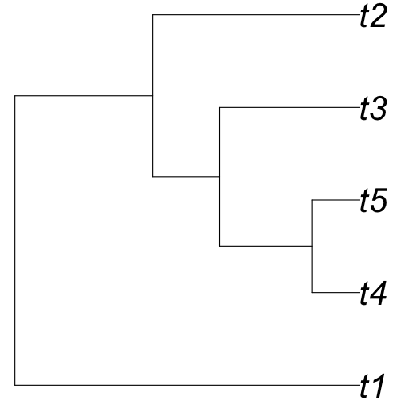
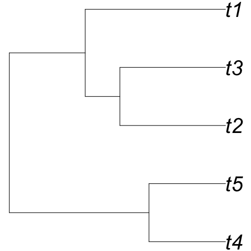
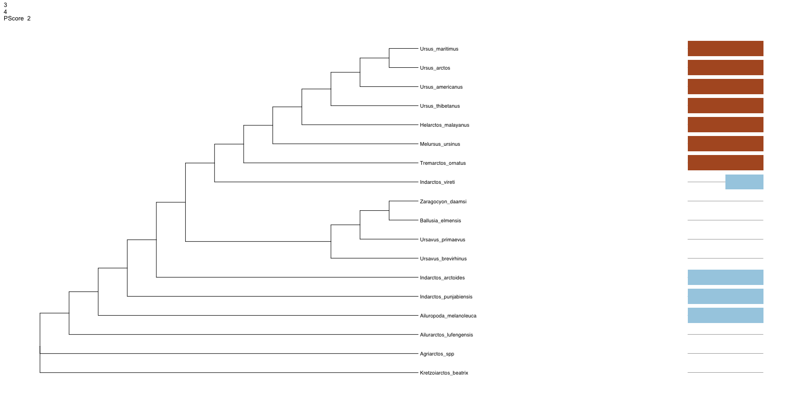

Tree Thinking
========================================================
author: April Wright
date: 08.09.2018
autosize: true

Good Morning!
========================================================

- What is a tree?
- How is a tree built?
- What are phylogenetic data?

What do we do with a phylogeny?
========================================================
- Determine the timing of trait evolution


What do we do with a phylogeny?
========================================================
-Tell homology from convergence


What do we do with a phylogeny?
========================================================
-Taxonomy


What do we do with a phylogeny?
========================================================
-Taxonomy


- Hennig, 1950 Grundzüge einer Theorie der Phylogenetischen Systematik
  - Taxonomy should be logically consistent with the tree for the group

What do we do with a phylogeny?
========================================================
-Taxonomy


- Hennig, 1950 Grundzüge einer Theorie der Phylogenetischen Systematik
  - Taxonomy should be logically consistent with the tree for the group
- Sneath & Sokal, 1963, 1973
  - Using distance matrices to cluster based on phenetic similarity

Tree Terms: Tip
========================================================

```r
library(phytools)
tree <- pbtree(n = 5)
plot(tree, cex = 3.5, no.margin = TRUE, edge.width = 1.5)
```


Tip: What we are putting on the tree. May be species, individuals, or higher-order taxa.
May be called terminal node, leaf, one degree node.

Tree Terms: Tip
========================================================

```r
library(phytools)
tree <- pbtree(n = 5)
plot(tree, cex = 3.5, no.margin = TRUE, edge.width = 1.5)
```


Branch: What connects the tip to the tree. Can have a variety of units, which we will discuss over the next few days.
May be called edge.

Tree Terms: Node
========================================================

```r
library(phytools)
tree <- pbtree(n = 5)
plot(tree, cex = 3.5, no.margin = TRUE, edge.width = 1.5)
```


Node: Where nodes meet, implying a most recent common ancestor.
May be called vertex, or three-degree node.

Tree Terms
========================================================

```r
plot(tree, cex = 3.5, no.margin = TRUE, edge.width = 1.5, direction = "downwards")
```


Tree Terms
========================================================


```r
plot(tree, cex = 3.5, no.margin = TRUE, edge.width = 1.5, type="fan")
```


Tree Terms: Rotation - reflecting taxa at a node
========================================================


```r
plot(tree, cex = 3.5, no.margin = TRUE, edge.width = 1.5)
nodelabels(cex = 3.5)
```


```r
#rotateNodes(tree, c(8,9))
#plot(tree, cex = 3.5, no.margin = TRUE, edge.width = 1.5)
```

Tree Terms: Monophyletic - an ancestor and all its descendents
========================================================


```r
is.monophyletic(tree, c("t1", "t2"), plot = TRUE, edge.width = 1.5, cex = 3.5, no.margin = TRUE)
```


```
[1] FALSE
```

Tree Terms: Rooting
========================================================


```r
# reroot(tree, node.number)
plot(tree, cex = 3.5, no.margin = TRUE, edge.width = 1.5)
```


Ingroup: Taxa of interest
Outgroup: Taxon closely related used to root the tree

Tree Terms: Rooting
========================================================


```r
unroot_tree <- unroot(tree)
plot(unroot_tree, cex = 3.5, no.margin = TRUE, edge.width = 1.5)
```


How is a tree built?
========================================================

- Many ways. We will focus on three:
  - Maximum parsimony
  - Maximum likelihood
  - Bayesian inference

Parsimony
========================================================

- Not only applied in phylogenetics
- The simplest explanation for the observed data is the best

Phylogenetic Data
========================================================


```r
library(alignfigR)
char_data <- read_alignment("data/bears_fasta.fa")
char_data[1:3]
```

```
$Agriarctos_spp
 [1] "?" "0" "?" "?" "?" "?" "?" "?" "?" "?" "?" "?" "?" "?" "?" "?" "0"
[18] "0" "0" "1" "1" "1" "1" "0" "0" "1" "?" "1" "1" "?" "0" "1" "1" "1"
[35] "1" "0" "1" "1" "0" "?" "?" "0" "1" "1" "1" "0" "?" "?" "?" "?" "?"
[52] "?" "?" "?" "?" "?" "?" "?" "?" "?" "?" "?"

$Ailurarctos_lufengensis
 [1] "?" "0" "?" "?" "?" "?" "?" "?" "?" "?" "?" "?" "?" "?" "?" "?" "?"
[18] "0" "0" "1" "1" "1" "1" "0" "1" "1" "?" "1" "1" "?" "0" "?" "?" "?"
[35] "?" "0" "1" "1" "1" "?" "0" "0" "1" "1" "1" "0" "1" "0" "1" "1" "0"
[52] "1" "1" "?" "?" "?" "?" "?" "?" "?" "?" "?"

$Ailuropoda_melanoleuca
 [1] "1" "0" "1" "1" "1" "1" "0" "1" "1" "0" "1" "0" "0" "1" "0" "0" "0"
[18] "0" "0" "1" "1" "1" "1" "0" "1" "0" "1" "1" "1" "0" "0" "1" "0" "1"
[35] "0" "0" "1" "1" "0" "0" "0" "0" "1" "1" "1" "0" "1" "0" "0" "1" "0"
[52] "1" "1" "0" "0" "0" "1" "0" "0" "0" "1" "0"
```

Phylogenetic Data
========================================================


```r
library(alignfigR)
char_data <- read_alignment("data/bears_fasta.fa")
char_data[1:3]
```

```
$Agriarctos_spp
 [1] "?" "0" "?" "?" "?" "?" "?" "?" "?" "?" "?" "?" "?" "?" "?" "?" "0"
[18] "0" "0" "1" "1" "1" "1" "0" "0" "1" "?" "1" "1" "?" "0" "1" "1" "1"
[35] "1" "0" "1" "1" "0" "?" "?" "0" "1" "1" "1" "0" "?" "?" "?" "?" "?"
[52] "?" "?" "?" "?" "?" "?" "?" "?" "?" "?" "?"

$Ailurarctos_lufengensis
 [1] "?" "0" "?" "?" "?" "?" "?" "?" "?" "?" "?" "?" "?" "?" "?" "?" "?"
[18] "0" "0" "1" "1" "1" "1" "0" "1" "1" "?" "1" "1" "?" "0" "?" "?" "?"
[35] "?" "0" "1" "1" "1" "?" "0" "0" "1" "1" "1" "0" "1" "0" "1" "1" "0"
[52] "1" "1" "?" "?" "?" "?" "?" "?" "?" "?" "?"

$Ailuropoda_melanoleuca
 [1] "1" "0" "1" "1" "1" "1" "0" "1" "1" "0" "1" "0" "0" "1" "0" "0" "0"
[18] "0" "0" "1" "1" "1" "1" "0" "1" "0" "1" "1" "1" "0" "0" "1" "0" "1"
[35] "0" "0" "1" "1" "0" "0" "0" "0" "1" "1" "1" "0" "1" "0" "0" "1" "0"
[52] "1" "1" "0" "0" "0" "1" "0" "0" "0" "1" "0"
```
These data are binary

Phylogenetic Data
========================================================


```r
library(alignfigR)
char_data <- read_alignment("data/bears_fasta.fa")
char_data[1:3]
```

```
$Agriarctos_spp
 [1] "?" "0" "?" "?" "?" "?" "?" "?" "?" "?" "?" "?" "?" "?" "?" "?" "0"
[18] "0" "0" "1" "1" "1" "1" "0" "0" "1" "?" "1" "1" "?" "0" "1" "1" "1"
[35] "1" "0" "1" "1" "0" "?" "?" "0" "1" "1" "1" "0" "?" "?" "?" "?" "?"
[52] "?" "?" "?" "?" "?" "?" "?" "?" "?" "?" "?"

$Ailurarctos_lufengensis
 [1] "?" "0" "?" "?" "?" "?" "?" "?" "?" "?" "?" "?" "?" "?" "?" "?" "?"
[18] "0" "0" "1" "1" "1" "1" "0" "1" "1" "?" "1" "1" "?" "0" "?" "?" "?"
[35] "?" "0" "1" "1" "1" "?" "0" "0" "1" "1" "1" "0" "1" "0" "1" "1" "0"
[52] "1" "1" "?" "?" "?" "?" "?" "?" "?" "?" "?"

$Ailuropoda_melanoleuca
 [1] "1" "0" "1" "1" "1" "1" "0" "1" "1" "0" "1" "0" "0" "1" "0" "0" "0"
[18] "0" "0" "1" "1" "1" "1" "0" "1" "0" "1" "1" "1" "0" "0" "1" "0" "1"
[35] "0" "0" "1" "1" "0" "0" "0" "0" "1" "1" "1" "0" "1" "0" "0" "1" "0"
[52] "1" "1" "0" "0" "0" "1" "0" "0" "0" "1" "0"
```
Always arranged with rows being taxa and columns corresponding to a character - "matrix" structure

Phylogenetic Data
========================================================


```r
library(ggplot2)
colors <- c("blue", "purple","white")
plot_alignment(char_data, colors, taxon_labels = TRUE) + theme(text = element_text(size=40))
```


Phylogenetic Data
========================================================


```r
library(ggplot2)
colors <- c("blue", "purple","white")
plot_alignment(char_data, colors, taxon_labels = TRUE) + theme(text = element_text(size=40))
```


How do we go from this to a tree?

Parsimony
========================================================
- Maximum parsimony: the tree that minimizes the number of "steps", or changes, on a tree is to be preferred
- Let's turn to the board for a minute: Parsimony informative, invariant, and parsimony non-informative variation

???
Have them start installs on the next page while we do this.

treesiftr
========================================================


```r
library(treesiftr)
aln_path <- "data/bears_fasta.fa"
bears <- read_alignment(aln_path)
tree <- read.tree("data/starting_tree.tre")

sample_df <- generate_sliding(bears, start_char = 1, stop_char = 5, steps = 1)
print(sample_df)
```

```
  starting_val stop_val step_val
1            1        2        1
2            2        3        1
3            3        4        1
4            4        5        1
5            5        6        1
```

treesiftr
========================================================


```r
library(phangorn)
library(ggtree)
output_vector <- generate_tree_vis(sample_df = sample_df, alignment =                                        aln_path,tree = tree, phy_mat = bears,                                    pscore = TRUE)
```

```
Final p-score 4 after  2 nni operations 
[1] 1 2
Final p-score 5 after  0 nni operations 
[1] 2 3
Final p-score 6 after  0 nni operations 
[1] 3 4
Final p-score 6 after  1 nni operations 
[1] 4 5
Final p-score 4 after  2 nni operations 
[1] 5 6
```

treesiftr
========================================================


```r
output_vector #sample output - you will get more than this when you run in your console
```

```
[[1]]
```


```

[[2]]
```


```

[[3]]
```



```

[[4]]
```


```

[[5]]
```


???
Do a couple trees on the board, including the pruning algorithm.
Then allow them to play.


Parsimony: Many trees for one character and 4 taxa
========================================================


???
This is one character. Imagine many - enumeration is not possible.Also note that several trees have the same "best" tree


Parsimony: How do we find the most parsimonious tree?
========================================================

- We're going to take an exercise break and play with PAUP
  - http://phylosolutions.com/paup-test/
  - Download the command line executeable for your OS
  - Copy it into this repository
  - Open a terminal

PAUP
========================================================


```paup
execute data/bears_morphology.nex
```
- NOTE: PAUP allows tab-completion
- Open the bears_morphology file in a text editor. Now:


PAUP: A couple important commands
========================================================


```paup
cstatus
tstatus
showmatrix
showdist
log file="mylogfile"
```
- Try each of these - what information do they give you?


PAUP: Building a tree
========================================================


```paup
alltrees
```
What happened here?

Parsimony: Enumeration is not possible for more than 12 taxa
========================================================


???
This is one character. Imagine many - enumeration is not possible.Also note that several trees have the same "best" tree

PAUP: Heuristic Searches
========================================================
Heuristic - use of shortcuts to reduce the number of trees we need to search

```paup
hsearch
```

- What is the name of the heuristic that was used?
- How was the initial tree discovered?
- How many trees were searched?
- How many "best" trees were there, and what is their score?

PAUP: Heuristic Searches
========================================================
Heuristic - use of shortcuts to reduce the number of trees we need to search

```paup
hsearch swap = nni
```

- How many trees were examined with this algorithm? Why is this number so much smaller?
- How many "best" trees were found, and what is their score?

PAUP: Heuristic Searches
========================================================
Heuristic - use of shortcuts to reduce the number of trees we need to search

```paup
hsearch swap = spr
```

- How many trees were examined with this algorithm?
- How many "best" trees were found, and what is their score?
- When would we expect searching algorithm to matter strongly?

PAUP: Exporting parsimony trees
========================================================


```paup
savetrees from=1 to=1 file=results/tree1.tre;
savetrees from=2 to=2 file=results/tree2.tre;
savetrees from=3 to=3 file=results/tree3.tre;

```


PAUP: Exporting parsimony trees
========================================================


```r
library(gridExtra)
tree1 <- read.nexus("results/tree1.tre")
tree2 <- read.nexus("results/tree2.tre")
tree3 <- read.nexus("results/tree3.tre")
plot(tree1)
```


PAUP: What do we do with multiple "best" trees?
========================================================


???
This is one character. Imagine many - enumeration is not possible.Also note that several trees have the same "best" tree

PAUP: What do we do with multiple "best" trees?
========================================================
- Typically: Build a consensus tree

```paup
  contree all / treefile=Results/contree.tre;
  help contree
```
- Please look at:
  - Semistrict
  - Majority rule
  - Adams


How do we assess confidence in a tree?
========================================================
- The bootstrap

```r
char_mat <- phangorn::phyDat(char_data, levels = c(0, 1, "?"), type = "USER")
samples <- sample(1:62, 62, replace = TRUE)
new_mat <- subset(char_mat, select=samples)
samples
```

```
 [1]  6 31 36 50  1 53 48 32 56 16 52 51 40 52 20 49 34 51 62 54 10 45  4
[24] 23 27 30 44  2 61 52 22 61 34 26 41 38 47 61 33 56 39 52 62 55 36 53
[47] 50 14 30 12 56 60 61 43 57 50 17  7 31 58 34 55
```

How do we assess confidence in a tree?
========================================================
- The bootstrap samples characters _with_ replacement

```r
char_mat <- phangorn::phyDat(char_data, levels = c(0, 1, "?"), type = "USER")
list_of_mats <- list()
for (i in 1:100){
samples <- sample(1:62, 62, replace = TRUE)
new_mat <- subset(char_mat, select=samples)
list_of_mats[[i]] <- new_mat
}
```
Generates a tree from each matrix

The bootstrap
========================================================


```r
plot(tree1)
```


PAUP: The bootstrap
========================================================


```paup
bootstrap nreps=100 search=heuristic /addseq=random;
savetrees from=1 to=1 savebootp=nodelabels file=results/bootstrap.tre;
```

```r
b_tre <- read.nexus("results/bootstrap.tre")
plot(b_tre)
nodelabels(b_tre$nodelabels)
```


PAUP: The bootstrap
========================================================


```paup
bootstrap nreps=100 search=heuristic /addseq=random;
savetrees from=1 to=1 savebootp=nodelabels file=results/bootstrap.tre;
```

```r
b_tre <- read.nexus("results/bootstrap.tre")
plot(b_tre)
nodelabels(b_tre$node.label)
```


"b_tre$nodelabels" what is this construction?

PAUP: The jacknife
========================================================
Samples without replacement

```paup
jackknife nreps=100 search=heuristic /addseq=random;
savetrees from=1 to=1 savebootp=nodelabels file=results/jackknife.tre;
```


```r
j_tre <- read.nexus("results/jackknife.tre")
plot(j_tre)
nodelabels(j_tre$node.label)
```


Parsimony: Some of these trees imply homoplasy
========================================================


Is an answer that implies homoplasy ever the right one?

Parsimony: Different Step Matrices
========================================================

- Can make different character interchanges weigh more or less than others
- For example, for character 1, it might be more likely to go from 0 to 1 than the reverse
- Let's try this in PAUP

PAUP: Different Step Matrices
========================================================
- Open the bears_morphology file in a test editor. Scroll all the way to the bottom and paste in:

```paup
begin assumptions;
 usertype my_ctype stepmatrix=2
     0 1
 [0] . 1
 [1] 0 .

 ;
end;
```

PAUP: Different Step Matrices
========================================================
- In the PAUP executeable:

```paup
ctype my_ctype:1
hsearch
```

PAUP: Different Step Matrices
========================================================

- For those of you who are more familiar with likelihood and Bayesian analyses, what does this sound like? 

- We'll pick up this afternoon with Bayesian models
