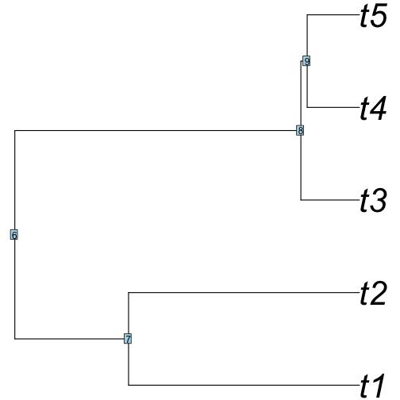
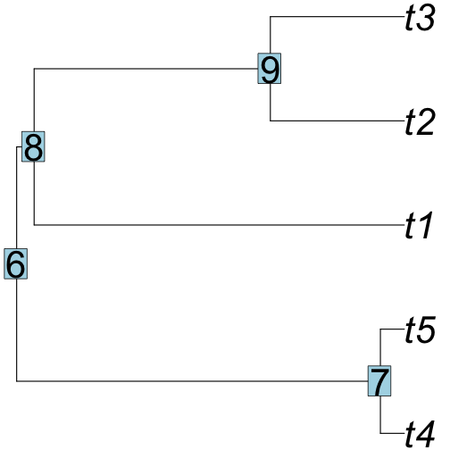
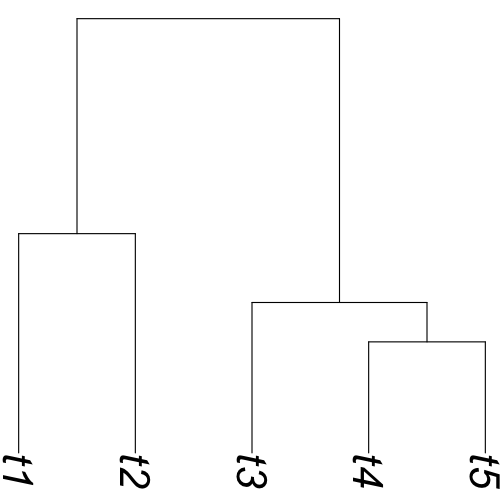
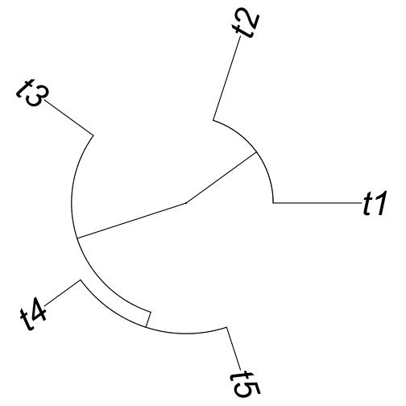
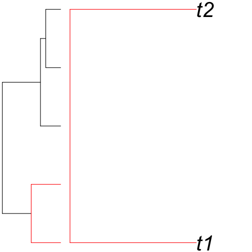
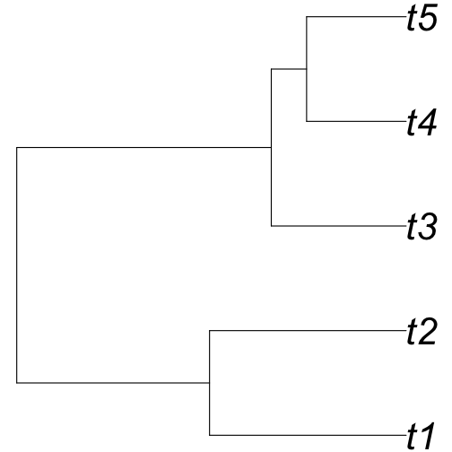

Tree Thinking
========================================================
author: April Wright
date: 08.09.2018
autosize: true

Good Morning!
========================================================

- What is a tree?
- How is a tree built?
- What are phylogenetic data?

What do we do with a phylogeny?
========================================================
- Determine the timing of trait evolution


What do we do with a phylogeny?
========================================================
-Tell homology from convergence


What do we do with a phylogeny?
========================================================
-Taxonomy


What do we do with a phylogeny?
========================================================
-Taxonomy


- Hennig, 1950 Grundzüge einer Theorie der Phylogenetischen Systematik
  - Taxonomy should be logically consistent with the tree for the group

What do we do with a phylogeny?
========================================================
-Taxonomy


- Hennig, 1950 Grundzüge einer Theorie der Phylogenetischen Systematik
  - Taxonomy should be logically consistent with the tree for the group
- Sneath & Sokal, 1963, 1973
  - Using distance matrices to cluster based on phenetic similarity

Tree Terms: Tip
========================================================

```r
library(phytools)
tree <- pbtree(n = 5)
plot(tree, cex = 3.5, no.margin = TRUE, edge.width = 1.5)
```


Tip: What we are putting on the tree. May be species, individuals, or higher-order taxa.
May be called terminal node, leaf, one degree node.

Tree Terms: Tip
========================================================

```r
library(phytools)
tree <- pbtree(n = 5)
plot(tree, cex = 3.5, no.margin = TRUE, edge.width = 1.5)
```


Branch: What connects the tip to the tree. Can have a variety of units, which we will discuss over the next few days.
May be called edge.

Tree Terms: Node
========================================================

```r
library(phytools)
tree <- pbtree(n = 5)
plot(tree, cex = 3.5, no.margin = TRUE, edge.width = 1.5)
```


Node: Where nodes meet, implying a most recent common ancestor.
May be called vertex, or three-degree node.

Tree Terms
========================================================

```r
plot(tree, cex = 3.5, no.margin = TRUE, edge.width = 1.5, direction = "downwards")
```




Tree Terms
========================================================


```r
plot(tree, cex = 3.5, no.margin = TRUE, edge.width = 1.5, type="fan")
```




Tree Terms: Rotation - reflecting taxa at a node
========================================================


```r
plot(tree, cex = 3.5, no.margin = TRUE, edge.width = 1.5)
nodelabels(cex = 3.5)
```



```r
#rotateNodes(tree, c(8,9))
#plot(tree, cex = 3.5, no.margin = TRUE, edge.width = 1.5)
```

Tree Terms: Monophyletic - an ancestor and all its descendents
========================================================


```r
is.monophyletic(tree, c("t1", "t2"), plot = TRUE, edge.width = 1.5, cex = 3.5, no.margin = TRUE)
```


```
[1] FALSE
```

Tree Terms: Rooting
========================================================


```r
# reroot(tree, node.number)
plot(tree, cex = 3.5, no.margin = TRUE, edge.width = 1.5)
```


Ingroup: Taxa of interest
Outgroup: Taxon closely related used to root the tree

Tree Terms: Rooting
========================================================


```r
unroot_tree <- unroot(tree)
plot(unroot_tree, cex = 3.5, no.margin = TRUE, edge.width = 1.5)
```



How is a tree built?
========================================================

- Many ways. We will focus on three:
  - Maximum parsimony
  - Maximum likelihood
  - Bayesian inference

Parsimony
========================================================

- Not only applied in phylogenetics
- The simplest explanation for the observed data is the best

Phylogenetic Data
========================================================


```r
library(alignfigR)
char_data <- read_alignment("data/bears_fasta.fa")
char_data[1:3]
```

```
$Agriarctos_spp
 [1] "?" "0" "?" "?" "?" "?" "?" "?" "?" "?" "?" "?" "?" "?" "?" "?" "0"
[18] "0" "0" "1" "1" "1" "1" "0" "0" "1" "?" "1" "1" "?" "0" "1" "1" "1"
[35] "1" "0" "1" "1" "0" "?" "?" "0" "1" "1" "1" "0" "?" "?" "?" "?" "?"
[52] "?" "?" "?" "?" "?" "?" "?" "?" "?" "?" "?"

$Ailurarctos_lufengensis
 [1] "?" "0" "?" "?" "?" "?" "?" "?" "?" "?" "?" "?" "?" "?" "?" "?" "?"
[18] "0" "0" "1" "1" "1" "1" "0" "1" "1" "?" "1" "1" "?" "0" "?" "?" "?"
[35] "?" "0" "1" "1" "1" "?" "0" "0" "1" "1" "1" "0" "1" "0" "1" "1" "0"
[52] "1" "1" "?" "?" "?" "?" "?" "?" "?" "?" "?"

$Ailuropoda_melanoleuca
 [1] "1" "0" "1" "1" "1" "1" "0" "1" "1" "0" "1" "0" "0" "1" "0" "0" "0"
[18] "0" "0" "1" "1" "1" "1" "0" "1" "0" "1" "1" "1" "0" "0" "1" "0" "1"
[35] "0" "0" "1" "1" "0" "0" "0" "0" "1" "1" "1" "0" "1" "0" "0" "1" "0"
[52] "1" "1" "0" "0" "0" "1" "0" "0" "0" "1" "0"
```

Phylogenetic Data
========================================================


```r
library(alignfigR)
char_data <- read_alignment("data/bears_fasta.fa")
char_data[1:3]
```

```
$Agriarctos_spp
 [1] "?" "0" "?" "?" "?" "?" "?" "?" "?" "?" "?" "?" "?" "?" "?" "?" "0"
[18] "0" "0" "1" "1" "1" "1" "0" "0" "1" "?" "1" "1" "?" "0" "1" "1" "1"
[35] "1" "0" "1" "1" "0" "?" "?" "0" "1" "1" "1" "0" "?" "?" "?" "?" "?"
[52] "?" "?" "?" "?" "?" "?" "?" "?" "?" "?" "?"

$Ailurarctos_lufengensis
 [1] "?" "0" "?" "?" "?" "?" "?" "?" "?" "?" "?" "?" "?" "?" "?" "?" "?"
[18] "0" "0" "1" "1" "1" "1" "0" "1" "1" "?" "1" "1" "?" "0" "?" "?" "?"
[35] "?" "0" "1" "1" "1" "?" "0" "0" "1" "1" "1" "0" "1" "0" "1" "1" "0"
[52] "1" "1" "?" "?" "?" "?" "?" "?" "?" "?" "?"

$Ailuropoda_melanoleuca
 [1] "1" "0" "1" "1" "1" "1" "0" "1" "1" "0" "1" "0" "0" "1" "0" "0" "0"
[18] "0" "0" "1" "1" "1" "1" "0" "1" "0" "1" "1" "1" "0" "0" "1" "0" "1"
[35] "0" "0" "1" "1" "0" "0" "0" "0" "1" "1" "1" "0" "1" "0" "0" "1" "0"
[52] "1" "1" "0" "0" "0" "1" "0" "0" "0" "1" "0"
```
These data are binary

Phylogenetic Data
========================================================


```r
library(alignfigR)
char_data <- read_alignment("data/bears_fasta.fa")
char_data[1:3]
```

```
$Agriarctos_spp
 [1] "?" "0" "?" "?" "?" "?" "?" "?" "?" "?" "?" "?" "?" "?" "?" "?" "0"
[18] "0" "0" "1" "1" "1" "1" "0" "0" "1" "?" "1" "1" "?" "0" "1" "1" "1"
[35] "1" "0" "1" "1" "0" "?" "?" "0" "1" "1" "1" "0" "?" "?" "?" "?" "?"
[52] "?" "?" "?" "?" "?" "?" "?" "?" "?" "?" "?"

$Ailurarctos_lufengensis
 [1] "?" "0" "?" "?" "?" "?" "?" "?" "?" "?" "?" "?" "?" "?" "?" "?" "?"
[18] "0" "0" "1" "1" "1" "1" "0" "1" "1" "?" "1" "1" "?" "0" "?" "?" "?"
[35] "?" "0" "1" "1" "1" "?" "0" "0" "1" "1" "1" "0" "1" "0" "1" "1" "0"
[52] "1" "1" "?" "?" "?" "?" "?" "?" "?" "?" "?"

$Ailuropoda_melanoleuca
 [1] "1" "0" "1" "1" "1" "1" "0" "1" "1" "0" "1" "0" "0" "1" "0" "0" "0"
[18] "0" "0" "1" "1" "1" "1" "0" "1" "0" "1" "1" "1" "0" "0" "1" "0" "1"
[35] "0" "0" "1" "1" "0" "0" "0" "0" "1" "1" "1" "0" "1" "0" "0" "1" "0"
[52] "1" "1" "0" "0" "0" "1" "0" "0" "0" "1" "0"
```
Always arranged with rows being taxa and columns corresponding to a character - "matrix" structure

Phylogenetic Data
========================================================


```r
library(ggplot2)
colors <- c("blue", "purple","white")
plot_alignment(char_data, colors, taxon_labels = TRUE) + theme(text = element_text(size=40))
```


Slide With Plot
========================================================


