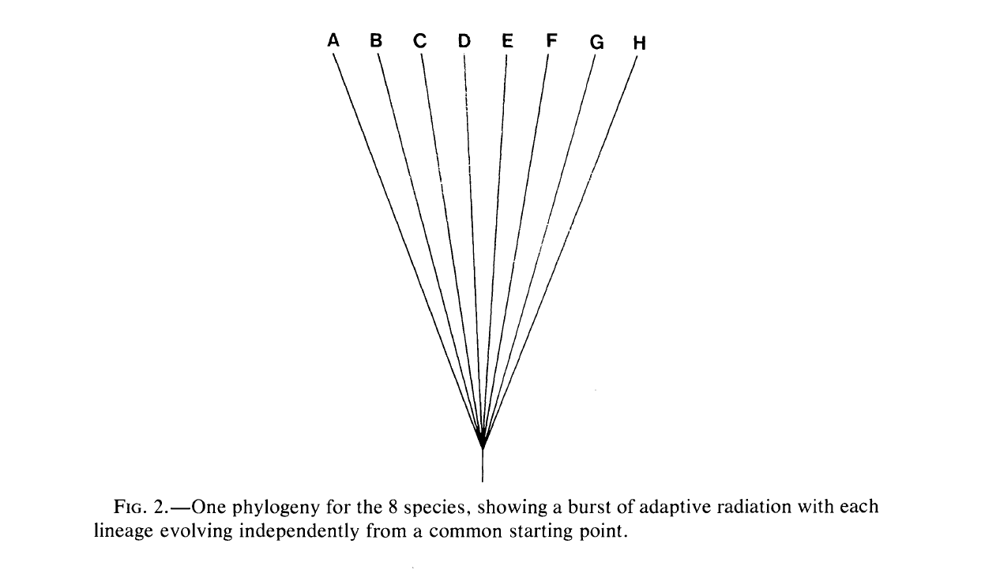
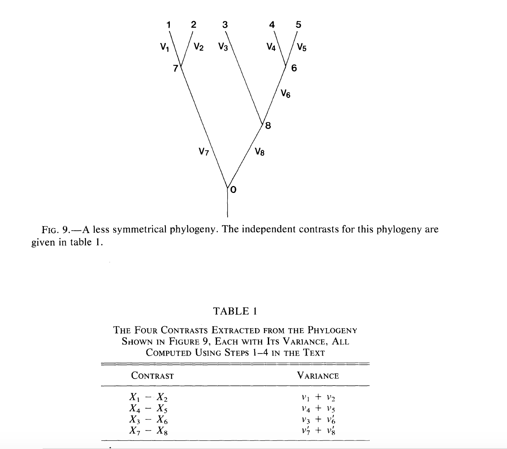

## So what are you going to do with your tree?


## Using trees to understand trait evolution

- What is a phylogeny?  
  - A model of evolutionary history  
  - Speciation and extinction  
  - Rates of evolution  
  - (Maybe) absolute time  
  
## Using trees to understand trait evolution

- But there are also special challenges to using phylogenetic trees to study the evolutionary history of traits

## Linear Regression

Let's say that in your group of organisms, you believe that arboreality is associated with lower visual acuity. 


## Linear Regression

Let's say that in your group of organisms, you believe that arboreality is associated with lower visual acuity. 


```{r}
arboreality <- c(.1, .2, .3, .4, .5, .6, .7, .8)
vis_ac <- c(1, .8, .6, .4, .35, .3, .25, .2)
plot(arboreality, vis_ac)
```


## Linear Regression

What is wrong with what we have done? 

```{r}
arboreality <- c(.1, .2, .3, .4, .5, .6, .7, .8)
vis_ac <- c(1, .8, .6, .4, .35, .3, .25, .2)
plot(arboreality, vis_ac)
```


## Linear Regression

What is wrong with what we have done? 

```{r}
arboreality <- c(.1, .2, .3, .4, .5, .6, .7, .8)
vis_ac <- c(1, .8, .6, .4, .35, .3, .25, .2)
plot(arboreality, vis_ac)
```

These are not independent datapoints!


## Linear Regression

What is the problem with what we've done? 



These are not independent datapoints!

## Linear Regression

Does this mean we simply can't make these comparsions?

## Linear Regression

Does this mean we simply can't make these comparsions?  

No! But we _must_ account for the effect of shared heritage.

## Brownian Motion


- Based on the random movement of particles in fluid

- The idea is that sucessive movements are independent of each other.

## Brownian Motion

- Under this model, traits evolve due to a continuous random walk. 

- The difference (contrast) between the traits possessed by any two tips on the tree will be normally distributed. The mean of the normal will be 0, and the variance will be proportional to the time since common ancestor. 

## Brownian Motion

```{r}
x <- seq(-4, 4, length=100)
norms <- dnorm(x, sd = 1)
plot(norms)
```

## Brownian Motion


```{r}
steps <- 0:50  
var <- 0.01
x <- rnorm(n = length(steps) - 1, sd = sqrt(var))
x <- c(0, cumsum(x))
plot(steps, x, type = "line")
```

## Brownian Motion
```{r}
steps <- 0:50  
var <- 0.01
n_sims <- 50
sim_mat <- matrix(0, n_sims, length(steps))


for (i in 1:n_sims) {
  sim_mat[i, ] <- c(0, cumsum(rnorm(n = length(steps) - 1, sd = sqrt(var))))
}

plot(steps, sim_mat[1, ], type = "line", ylim = c(2, -2)) #when you scale var, you may need to adjust the axis!

for (i in 1:n_sims) {
  lines(steps, sim_mat[i, ])
}
```

## Phylogenetically Independent Contrasts


1, 2, 3, 4 are not independent. But the difference between 1 & 2 is independent of the difference between 3 & 4.

## Phylogenetically Independent Contrasts



Contrasts usually standardized by the variance

## Brownian Motion on a Tree
```{r}
library(phytools)
tree <- pbtree(n=20)
x <- fastBM(tree, sig2 = var, internal = TRUE)
x
```

## Brownian Motion on a Tree
```{r}
phenogram(tree, x)
```

## Brownian Motion on a Tree
```{r}
x <- fastBM(tree, sig2 = var, internal = FALSE)
contrasts <- pic(x, tree, scaled=FALSE)
contrasts
```

## Brownian Motion on a Tree
```{r}
plot(tree)
nodelabels(contrasts)
```

## Brownian Motion on a Tree

```{r}
important_environmental_factor <- seq(from = 1, to = 19, by = 1)
plot(contrasts, important_environmental_factor)
```

## Two Implications

- Ancestral state estimation
- Models, and model assumptions

## Ancestral State Reconstruction

Phylogenetic independent contrasts assume we can estimate the value of the trait possessed by an ancestor through Brownian motion


## Ancestral State Reconstruction

- But we've already seen ancestral state estimation  
  - Recall the AND/OR rule discussions from day one  
  - Conditional probabilities - What is the likelihood of a state at the tips given the state at the nodes  
  - Ancestral state reconstruction allows us to apply this logic to external traits  
  
## Ancestral State Reconstruction

- Ancestral state reconstruction can vary in its complexity  
  - The first applications came from parsimony (Swofford and Maddison 1987)
  
## Ancestral State Reconstruction
```{r}
trait <- fastBM(tree_20)
phenogram(tree_20, trait)
anc_states <-anc.ML(tree_20, trait)
```

## Exporting annotations

```{r}
tree_20$tip.states <- trait
tree_20$node.labels <- anc_states$ace
write.tree(tree_20, file = "annotated.tre")
```