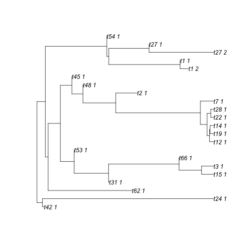
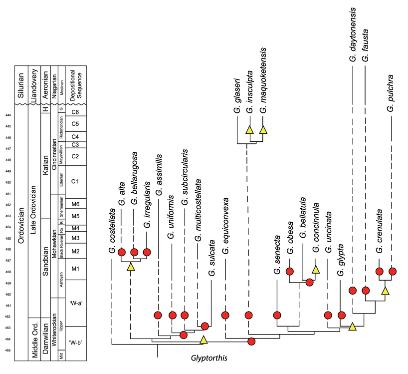
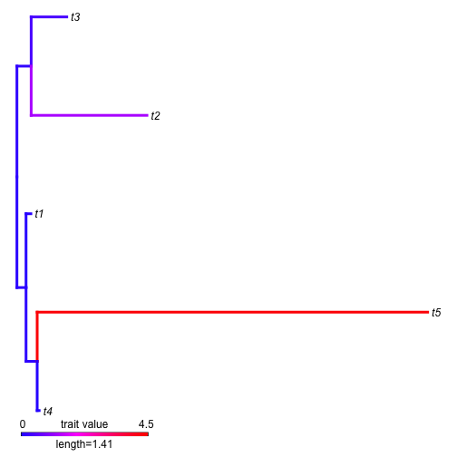
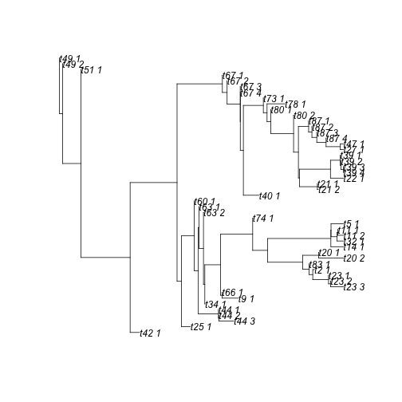
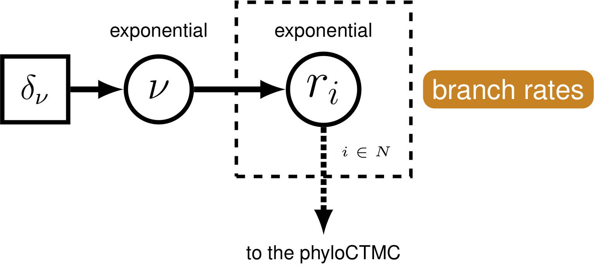
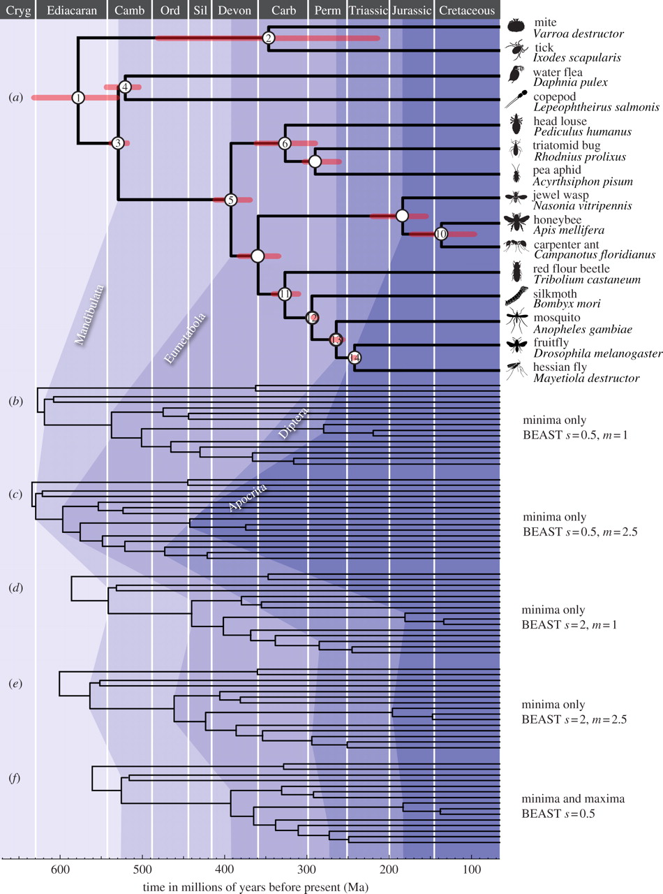
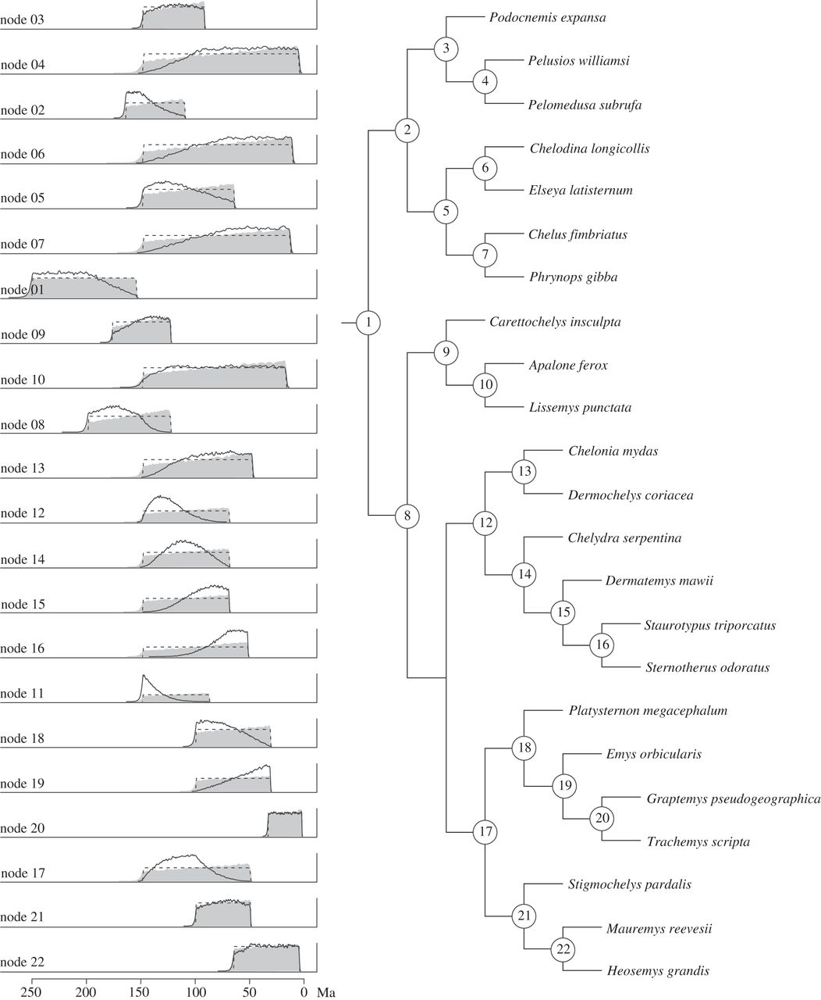
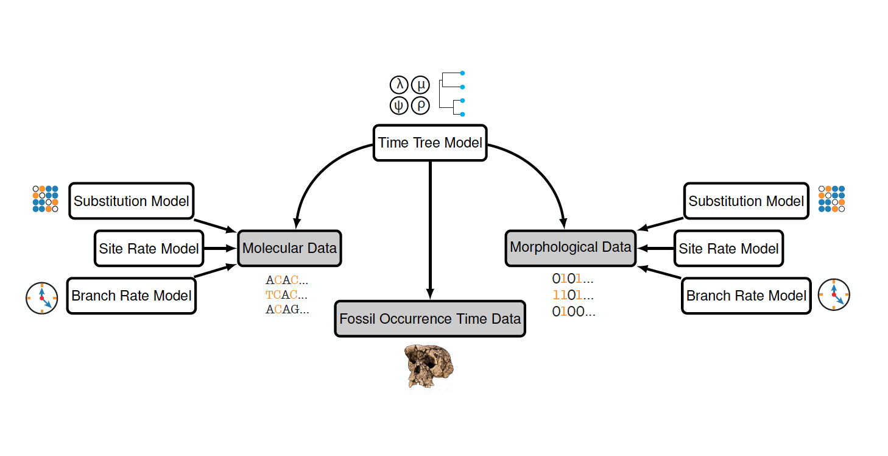

Dating a Phylogeny with the Fossilized Birth-Death
========================================================
author: April Wright
date: 08.10.2018
autosize: true

Macroevolution and Phylogeny
========================================================

## Phylogenetic trees are often used to study patterns of diversification, trait evolution, and lineage dispersal  

Macroevolution and Phylogeny
========================================================

## Phylogenetic trees are often used to study patterns of diversification, trait evolution, and lineage dispersal  

## *But the reverse is also true*


The Fossilized Birth-Death is a Macroevolutionary Model
========================================================


## It describes the distribution of lineages through time (Stadler 2010)


The Fossilized Birth-Death is a Macroevolutionary Model
========================================================


- Several key parameters


The Fossilized Birth-Death is a Macroevolutionary Model
========================================================


- Several key parameters


The Fossilized Birth-Death is a Macroevolutionary Model
========================================================


- Several key parameters


The Fossilized Birth-Death is a Macroevolutionary Model
========================================================

- Several key parameters


The Fossilized Birth-Death is a Macroevolutionary Model
========================================================

- Several key parameters


The Fossilized Birth-Death is a Phylogenetic Model
========================================================

- All of these parameters relate to the tree


Tree Models: Hands-On with FossilSim
========================================================
vignettes/03-FossilSim

Look at section ```Birth and Death``` first.

Sampled Ancestors
========================================================

- Under the fossilized birth-death model, it is possible to sample lineages that also have descendants on the tree


When do we observe more sampled ancestors? Look at some of your tree plots to find out. 

What do you think would happen to speciation rates if sampled ancestors are disallowed?

Tree Models: Hands-On with FossilSim
========================================================
vignettes/03-FossilSim

Now look at the sampling section


Tree Models: Hands-On with FossilSim
========================================================

```r
library(FossilSim)
library(ape)
tree <- sim.fbd.taxa(n=10, numbsim=1, lambda=3, mu=2, psi=2)
plot(tree[[1]])
```



This tree implies some values: that lineages have a time since origination, a time at extinction, and a time of sampling. How do we get them?

Yesterday, we unveiled a conflation
========================================================

Likelihood and Bayesian phylogenetic trees have a rate-based branch length

# distance =  rate x time

What if we're interested in time?



Stigall and Wright 2017

Why are we interested in time?
========================================================

- Time might be inherently interesting.


Why are we interested in time?
========================================================

- Time might be inherently interesting
- Time might tell us something interesting about natural history


Turner, et al. 2016

Why are we interested in time?
========================================================

- Time might be inherently interesting
- Time might tell us something interesting about natural history
- Time might be required to test hypotheses 


Alfaro et al. 2018

Information in a phylogenetic matrix
========================================================
- Does this tell you when (in absolute time) _Agriarctos spp_ diverged from _Ailurarctos lufengensis_? 

```r
library(treesiftr)
data(bears)
bears[1:4]
```

```
$Agriarctos_spp
 [1] "?" "0" "?" "?" "?" "?" "?" "?" "?" "?" "?" "?" "?" "?" "?" "?" "0"
[18] "0" "0" "1" "1" "1" "1" "0" "0" "1" "?" "1" "1" "?" "0" "1" "1" "1"
[35] "1" "0" "1" "1" "0" "?" "?" "0" "1" "1" "1" "0" "?" "?" "?" "?" "?"
[52] "?" "?" "?" "?" "?" "?" "?" "?" "?" "?" "?"

$Ailurarctos_lufengensis
 [1] "?" "0" "?" "?" "?" "?" "?" "?" "?" "?" "?" "?" "?" "?" "?" "?" "?"
[18] "0" "0" "1" "1" "1" "1" "0" "1" "1" "?" "1" "1" "?" "0" "?" "?" "?"
[35] "?" "0" "1" "1" "1" "?" "0" "0" "1" "1" "1" "0" "1" "0" "1" "1" "0"
[52] "1" "1" "?" "?" "?" "?" "?" "?" "?" "?" "?"

$Ailuropoda_melanoleuca
 [1] "1" "0" "1" "1" "1" "1" "0" "1" "1" "0" "1" "0" "0" "1" "0" "0" "0"
[18] "0" "0" "1" "1" "1" "1" "0" "1" "0" "1" "1" "1" "0" "0" "1" "0" "1"
[35] "0" "0" "1" "1" "0" "0" "0" "0" "1" "1" "1" "0" "1" "0" "0" "1" "0"
[52] "1" "1" "0" "0" "0" "1" "0" "0" "0" "1" "0"

$Ballusia_elmensis
 [1] "?" "0" "?" "?" "?" "?" "0" "1" "?" "0" "0" "0" "0" "0" "0" "0" "0"
[18] "0" "?" "0" "1" "0" "0" "0" "0" "0" "?" "1" "0" "0" "0" "0" "1" "0"
[35] "0" "?" "?" "0" "?" "?" "?" "0" "0" "0" "0" "0" "1" "0" "1" "1" "1"
[52] "1" "0" "?" "?" "?" "?" "?" "?" "?" "?" "?"
```
# No. 

Information in a phylogenetic matrix
========================================================
- Where do we get our information on absolute ages?

```r
data(bears)
bears[1:4]
```

```
$Agriarctos_spp
 [1] "?" "0" "?" "?" "?" "?" "?" "?" "?" "?" "?" "?" "?" "?" "?" "?" "0"
[18] "0" "0" "1" "1" "1" "1" "0" "0" "1" "?" "1" "1" "?" "0" "1" "1" "1"
[35] "1" "0" "1" "1" "0" "?" "?" "0" "1" "1" "1" "0" "?" "?" "?" "?" "?"
[52] "?" "?" "?" "?" "?" "?" "?" "?" "?" "?" "?"

$Ailurarctos_lufengensis
 [1] "?" "0" "?" "?" "?" "?" "?" "?" "?" "?" "?" "?" "?" "?" "?" "?" "?"
[18] "0" "0" "1" "1" "1" "1" "0" "1" "1" "?" "1" "1" "?" "0" "?" "?" "?"
[35] "?" "0" "1" "1" "1" "?" "0" "0" "1" "1" "1" "0" "1" "0" "1" "1" "0"
[52] "1" "1" "?" "?" "?" "?" "?" "?" "?" "?" "?"

$Ailuropoda_melanoleuca
 [1] "1" "0" "1" "1" "1" "1" "0" "1" "1" "0" "1" "0" "0" "1" "0" "0" "0"
[18] "0" "0" "1" "1" "1" "1" "0" "1" "0" "1" "1" "1" "0" "0" "1" "0" "1"
[35] "0" "0" "1" "1" "0" "0" "0" "0" "1" "1" "1" "0" "1" "0" "0" "1" "0"
[52] "1" "1" "0" "0" "0" "1" "0" "0" "0" "1" "0"

$Ballusia_elmensis
 [1] "?" "0" "?" "?" "?" "?" "0" "1" "?" "0" "0" "0" "0" "0" "0" "0" "0"
[18] "0" "?" "0" "1" "0" "0" "0" "0" "0" "?" "1" "0" "0" "0" "0" "1" "0"
[35] "0" "?" "?" "0" "?" "?" "?" "0" "0" "0" "0" "0" "1" "0" "1" "1" "1"
[52] "1" "0" "?" "?" "?" "?" "?" "?" "?" "?" "?"
```

Information in a phylogenetic matrix
========================================================
So, where do we get the information on absolute ages?

Information in a phylogenetic matrix
========================================================
So, where do we get the information on absolute ages?

## Divergence time estimation is the process by which we model the distribution of branch rates, speciation (& extinction events) and fossil presence to obtain node ages on a tree


Divergence time estimation
========================================================


Image via Rachel Warnock

Divergence time estimation
========================================================
- Strict clock


```r
library(phangorn)
library(ggtree)
library(ggplot2)
aln_path <- 'data/bears_fasta.fa'
sample_df <- generate_sliding(bears, start_char = 1, stop_char = 2, steps = 10)
output_vector <- generate_tree_vis(sample_df = sample_df, alignment =                                         aln_path, tree = tree, phy_mat = bears)
output_vector[[1]]
```



If we know the rate of sequence divergence is 1% per million years, we can date the tree by extrapolating from the amount of divergence.

Branch Rates
========================================================
- Strict clock

  - Reality: the rate at which mutations arise varies based on generation time, lifestyle, DNA repair. Evolutionary forces cause differences in if a mutation is fixed, or removed from the population.

Branch Rates
========================================================
- Strict clock


Reality: the rate at which mutations arise varies based on generation time, lifestyle, DNA repair. Evolutionary forces cause differences in if a mutation is fixed, or removed from the population.

Branch Rates
========================================================
- Relaxed clock

```r
library(phytools)
pb <- pbtree(n = 5)
branches <- (length(pb$tip.label)*2) - 2
rates <- rexp(n = branches, rate = 1)
pb$edge.length <- rates
plotBranchbyTrait(pb, rates, mode = "edges")
```



Branch Rates
========================================================
- Relaxed clock



Branch Rates
========================================================
## Many ways to describe how branch rates are distributed

- Global clock (Zuckerkandl & Pauling, 1962)
- Uncorrelated/independent rates models (Drummond et al. 2006;
Rannala & Yang 2007; Lepage et al. 2007)
- Log-normally distributed autocorrelated rates (Thorne, Kishino &
Painter 1998; Kishino, Thorne & Bruno 2001; Thorne & Kishino 2002)
- Local clocks (Hasegawa, Kishino & Yano 1989; Kishino & Hasegawa 1990; Yoder & Yang 2000; Yang & Yoder 2003, Drummond and Suchard 2010)
- Mixture models on branch rates (Heath, Holder, Huelsenbeck 2012)
- Punctuated rate change model (Huelsenbeck, Larget and Swoford 2000)

Slide from Rachel Warnock


Branch Rates
========================================================

```r
tree <- sim.fbd.taxa(n=10, numbsim=1, lambda=3, mu=2, psi=2)
plot(tree[[1]])
```


- Fundamental: In order to know something about the time since divergence, we need to know something about the rate at which differences accumulate

Divergence Time Estimation
========================================================

So we're done! We got it, right?

Divergence time estimation
========================================================


Image via Rachel Warnock

Including Fossils
========================================================

- Including fossils substantially improves estimations of divergence times
  - Fossils allow us to establish minimum ages for divergences 


Including Fossils: Calibrations
========================================================

- Fossils have typically been incorporated into analyses as what are called node calibrations

- Use distributions to describe the relationship between the fossil sampling event and the parent node (which generated the fossil)


Including Fossils: Calibrations
========================================================


Heath 2012

Including Fossils: Calibrations
========================================================


- Phylogenetic position not estimated from data
- We can only use the age of the oldest fossil

Including Fossils: Calibrations
========================================================



Warnock et al. 2012

Including Fossils: Calibrations
========================================================



Warnock et al. 2015

Including Fossils: Fossilized Birth-Death
========================================================

Include fossils as tips in our analysis


Heath, 2014

Including Fossils: Fossilized Birth-Death
========================================================


Including Fossils: Fossilized Birth-Death
========================================================

- Fossils can be placed simply as we did yesterday in the discrete morphology tutorial
- Can also be placed via reversible jump MCMC to be sampled ancestors 


Including Fossils: Fossilized Birth-Death
========================================================

With a partner: describe this graphical model in a couple sentences. What does each piece do? 



image from Rachel Warnock
