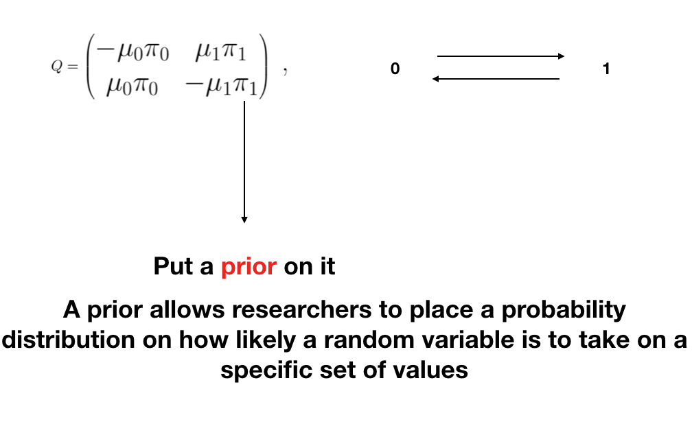
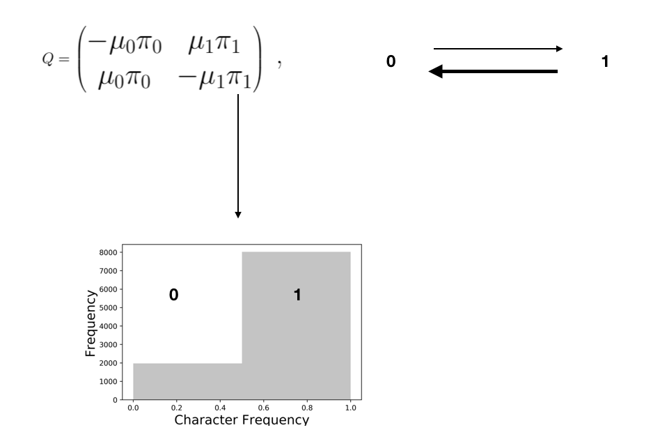

## Fossil Ants

## Fossil Ants 
 

## Fossil Ants

## Fossil Ants

## State Frequenies

$$Q_{JC69} = \begin{pmatrix} 
{*} & \frac{1}{3} & \frac{1}{3} & \frac{1}{3} \\ 
\frac{1}{3} & {*} & \frac{1}{3} & \frac{1}{3} \\ 
\frac{1}{3} & \frac{1}{3} & {*} & \frac{1}{3} \\ 
\frac{1}{3} & \frac{1}{3} & \frac{1}{3} & {*}  
\end{pmatrix} \mbox{  ,}$$

## State Frequenies

$$Q = \begin{pmatrix} -(k-1)\mu & \mu & \mu & \mu \\
\mu & -(k-1)\mu  & \mu & \mu \\
\mu & \mu & -(k-1)\mu  & \mu \\
\mu & \mu & \mu & -(k-1)\mu \\
\end{pmatrix} \mbox{  ,}$$

Pr(01) = Rate at which we expect 0->1 * probability of 0

## State Frequenies

$$Q = \begin{pmatrix} -(k-1)\mu & \mu\pi & \mu\pi & \mu\pi \\
\mu\pi_{1} & -(k-1)\mu  & \mu\pi_{1} & \mu\pi_{1} \\
\mu\pi_{2} & \mu\pi_{2} & -(k-1)\mu  & \mu\pi_{2} \\
\mu_{3} & \mu\pi_{3} & \mu_{3} & -(k-1)\mu \\
\end{pmatrix} \mbox{  ,}$$

Pr(01) = Rate at which we expect 0->1 * probability of 0  
Pr(01) = .75 * .5  
Pr(01) = 0.375

## A Prior On State Frequenies

But ... maybe every character in the dataset does not have the same equilibrium character frequency

## A Prior On State Frequencies

## A Prior On State Frequencies

## A Prior On State Frequencies

## A Prior On State Frequenies

## A Prior On State Frequenies

## A Prior On State Frequencies

## A Prior On State Frequencies

## The Symmetric Beta

## The Symmetric Beta

## The Beta Model

## The Symmetric Beta

$\alpha$ = $\beta$

## Site Heterogeneous Discrete Morphology Model

$\alpha$ != $\beta$

## Does it matter?

## Does it matter?

## Does it matter?

## Does it matter?

