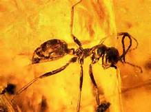
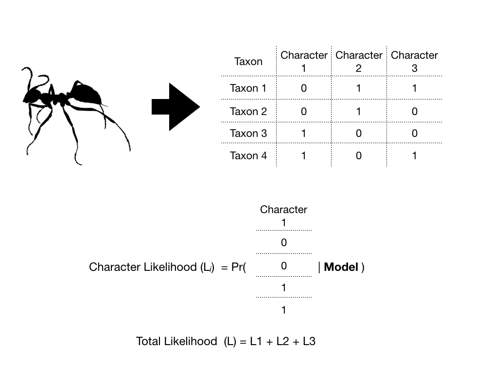
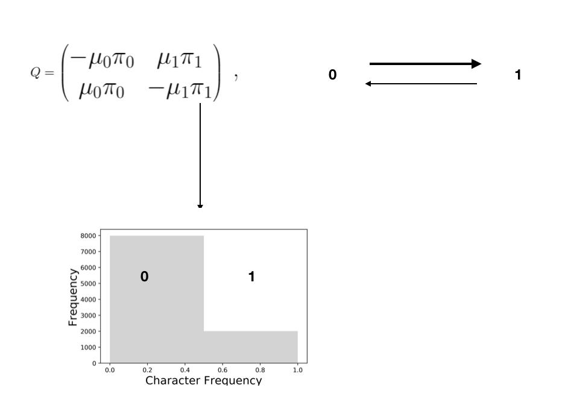
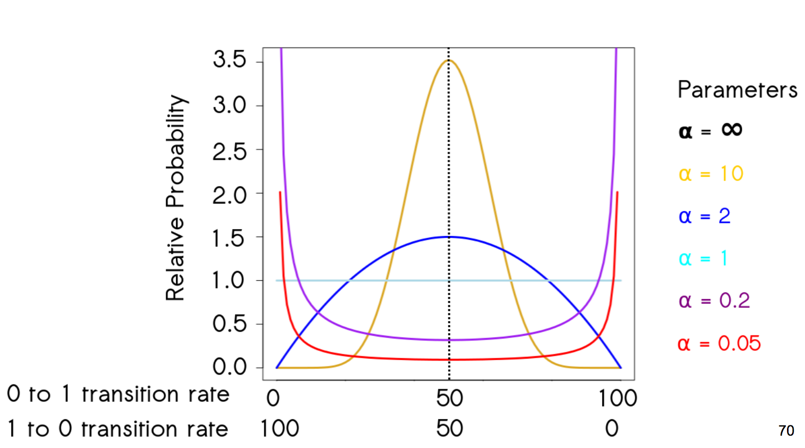
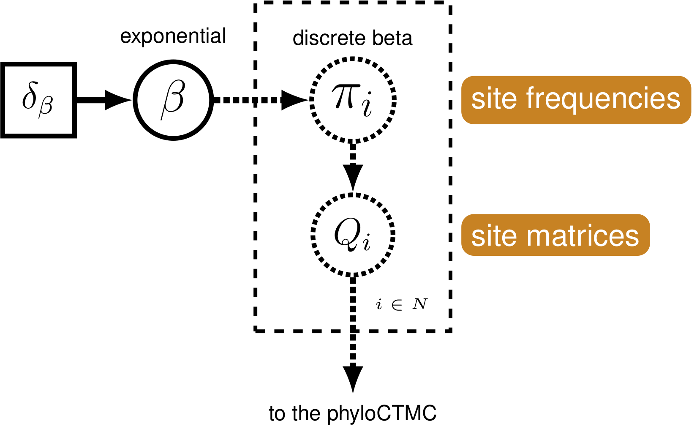
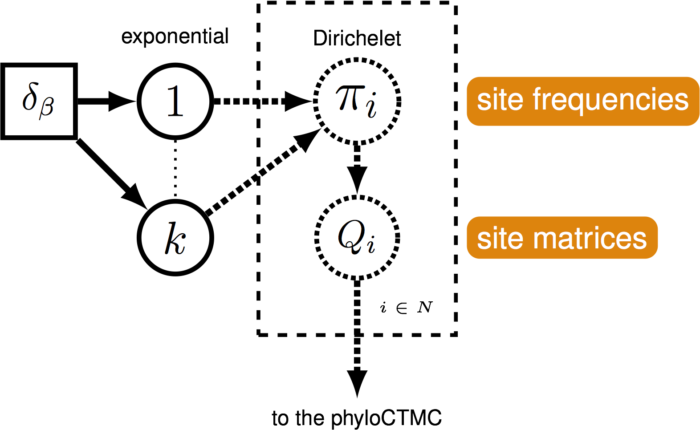

Relaxed Prior Motivation
========================================================
author: April Wright
date: 8.09.18
autosize: true

Fossil Ants
========================================================

Fossil Ants
========================================================

Fossil Ants
========================================================

Fossil Ants
========================================================

State Frequenies
========================================================

State Frequenies
========================================================

Pr(01) = Rate at which we expect 0->1 * probability of 0

State Frequenies
========================================================

Pr(01) = Rate at which we expect 0->1 * probability of 0  
Pr(01) = .75 * .5  
Pr(01) = 0.375

A Prior On State Frequenies
========================================================

But ... maybe every character in the dataset does not have the same equilibrium character frequency

A Prior On State Frequenies
========================================================

A Prior On State Frequenies
========================================================

A Prior On State Frequenies
========================================================

A Prior On State Frequenies
========================================================

A Prior On State Frequenies
========================================================

A Prior On State Frequenies
========================================================

A Prior On State Frequenies
========================================================

The Symmetric Beta
========================================================

The Symmetric Beta
========================================================

The Beta Model
========================================================

The Symmetric Beta
========================================================
$\alpha$ = $\beta$

Site Heterogeneous Discrete Morphology Model
========================================================
$\alpha$ != $\beta$
  

Does it matter?
========================================================

