Research And Teaching With RevBayes
========================================================
author: 
date: 
autosize: true

  
Overview
========================================================

- Introduction to graphical modeling
- How graphical modeling makes phylogenetic estimation more flexible

The Graphical Modeling Framework
========================================================

- What is a model?

The Graphical Modeling Framework
========================================================

- What is a model?
  + A model uses mathematics to describe a process, or the behavior of a system
  + Important facets of the generating process of the data are written down as parameters

The Graphical Modeling Framework
========================================================

- What is a model?
  + A model uses mathematics to describe a process, or the behavior of a system
  + Important facets of the generating process of the data are written down as parameters

- A graphical model represents the relationships and dependencies between model paramters

A simple case
========================================================

- An archer: Let's say the archer is a pretty good archer


```r
good_shots <- rnorm(n= 100, mean= 0, sd = 1)
hist(good_shots, main="Archer arrow shots",  xlab = "Inches from bullseye")
```

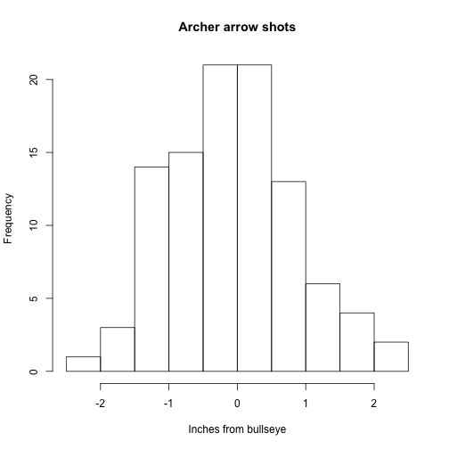

A simple case
========================================================

- An archer: Let's say the archer is a pretty bad archer


```r
bad_shots <- rnorm(n= 100, mean= 0, sd = 3)
hist(bad_shots, main="Archer arrow shots",  xlab = "Inches from bullseye")
```

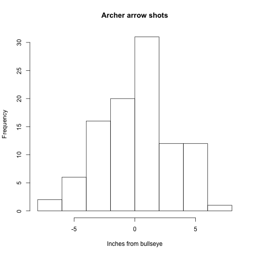

A simple case
========================================================

- It's easy to describe a model where we are manipulating one parameter
- But we rarely have such a simple case when we're analysing biological data

A **not so** simple case
========================================================

- It's easy to describe a model where we are manipulating one parameter
- But we rarely have such a simple case when we're analysing biological data
- We're describing the mechanisms that generated our observed data
  + In the case of a tree, this is the process of molecular or morphological evolution
  

A **not so** simple case
========================================================

- This is where graphical models come in

A **not so** simple case
========================================================

- This is where graphical models come in
- A **graphical model** represents the joint probability distribution as a graph

A **not so** simple case
========================================================

- This is where graphical models come in
- A graphical model represents the joint probability distribution as a graph
- **Nodes** are variables. **Edges** represent dependencies between nodes.

A **not so** simple case
========================================================

- This is where graphical models come in
- A graphical model represents the joint probability distribution as a graph
- **Nodes** are variables. **Edges** represent dependencies between nodes.


A **not so** simple case
========================================================

- This is where graphical models come in
- A graphical model represents the joint probability distribution as a graph
- **Nodes** are variables. **Edges** represent dependencies between nodes.


A **not so** simple case
========================================================

- This is where graphical models come in
- A graphical model represents the joint probability distribution as a graph
- **Nodes** are variables. **Edges** represent dependencies between nodes.


Pr( data | model )

A **not so** simple case
========================================================

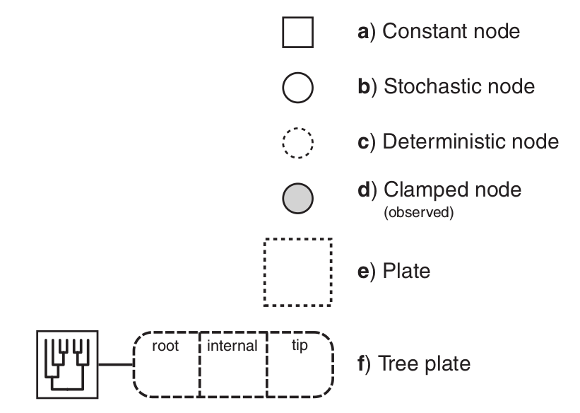


Phylogenetical Complexity
========================================================

- This is where graphical models come in
- A graphical model represents the joint probability distribution as a graph
- **Nodes** are variables. **Edges** represent dependencies between nodes.
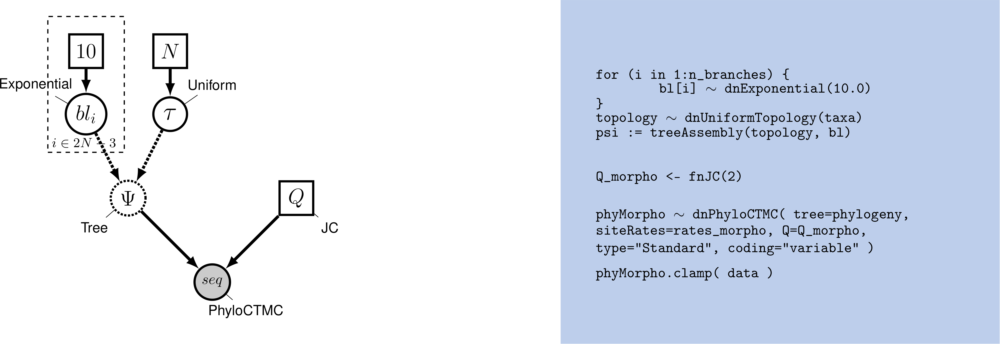

Phylogenetical complexity
========================================================

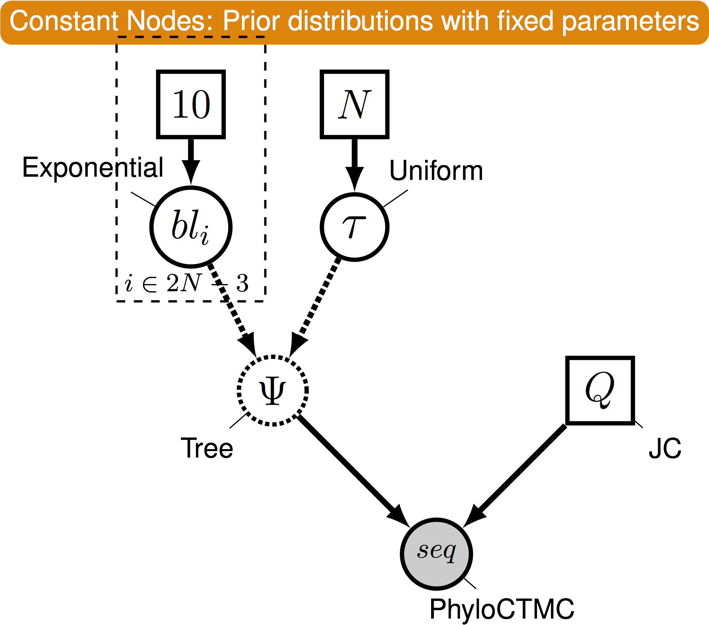

Phylogenetical complexity
========================================================

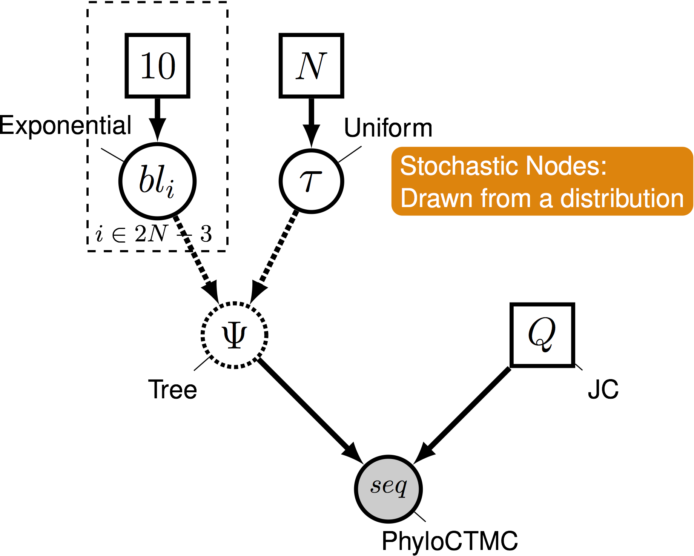

Phylogenetical complexity
========================================================

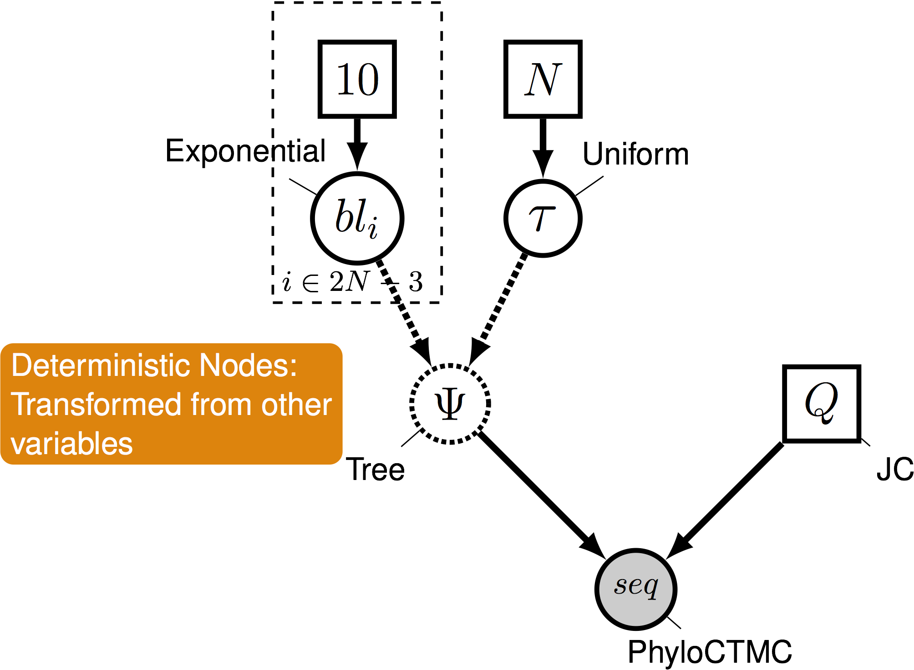

Phylogenetical complexity
========================================================

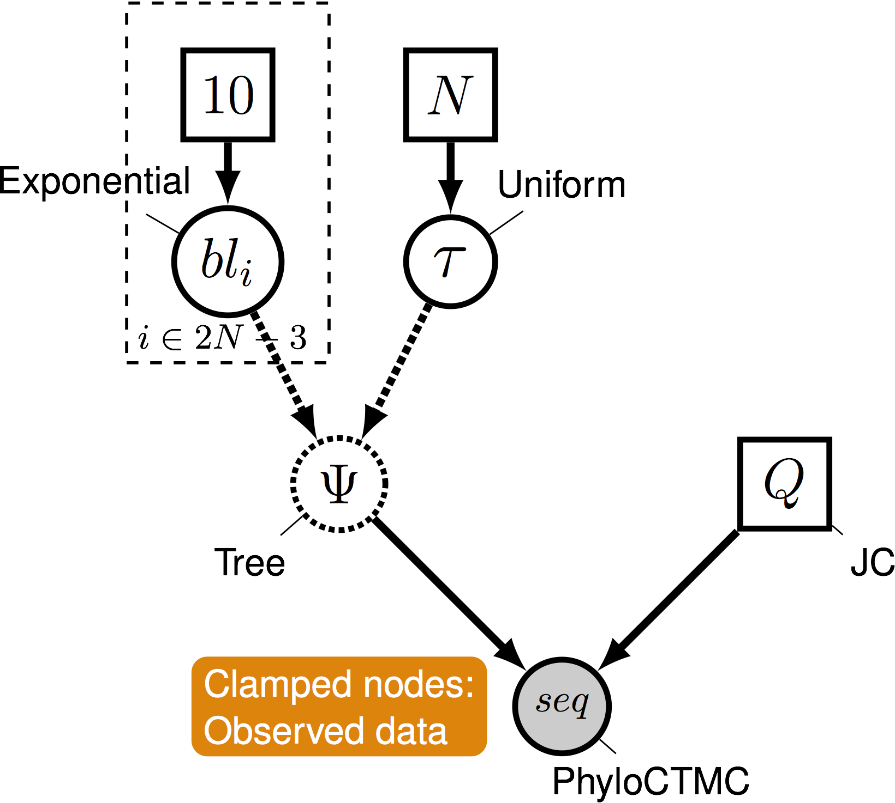


Phylogenetical complexity
========================================================

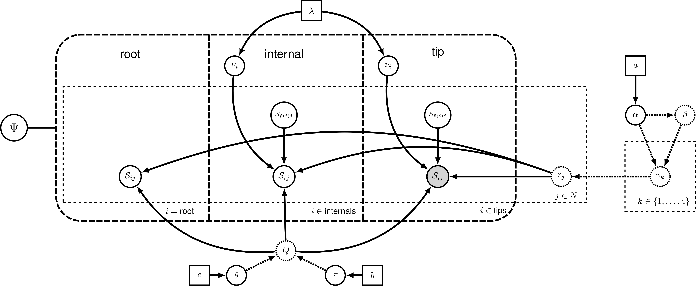

Who cares about graphical modeling?
========================================================

I'm going to make the case that this framework enables radical transparency in both research and pedagogy.


Engaging with underlying assumptions
========================================================

- Most phylogenetic estimations treat among-site rate variation as Gamma-distributed
 - Not every site in a nucleotide alignment evolves at the same rate
 - Not every character in a morphological dataset evolves at the same rate
 
Engaging with underlying assumptions
========================================================
 

 

Engaging with underlying assumptions
========================================================


```r
library(dplyr)
library(ggplot2)
dat <- data.frame(draws = c(rgamma(n = 500, shape = .1, scale = 10),rgamma(n = 500, shape = .5, scale = 10)))

d2 <- dat %>%  summarize(lower = quantile(dat$draws, probs = .25), middle = quantile(dat$draws, probs = .5), seventyfive = quantile(dat$draws, probs = .75), upper = quantile(dat$draws, probs = .99))

ggplot(dat, aes(x=draws)) + geom_density() + geom_vline(data = d2, aes(xintercept = lower)) + geom_vline(data = d2, aes(xintercept = middle)) +geom_vline(data = d2, aes(xintercept = seventyfive)) +geom_vline(data = d2, aes(xintercept = upper)) 
```

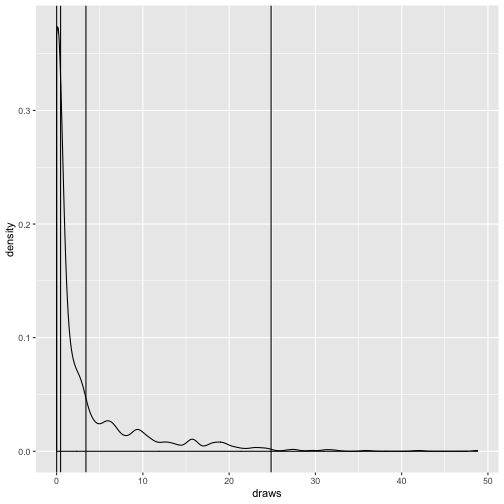


Engaging with underlying assumptions
========================================================
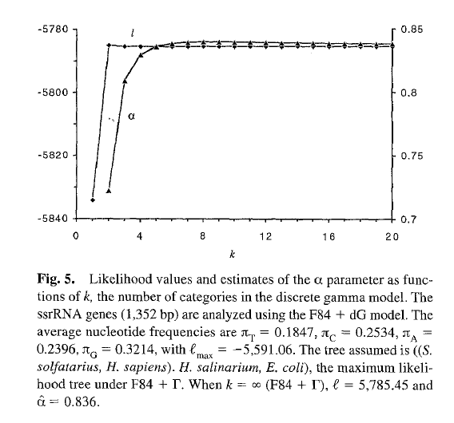

Yang (1994) demonstrated that modeling ASRV as Gamma distributed with 4 Gamma categories is sufficient

Engaging with underlying assumptions
========================================================
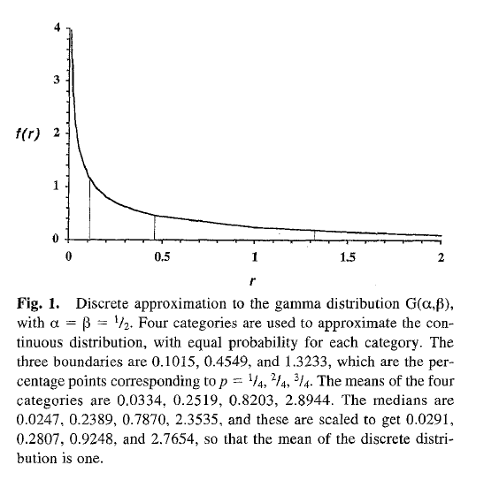

Implies many low- or zero-rate characters

Engaging with underlying assumptions
========================================================
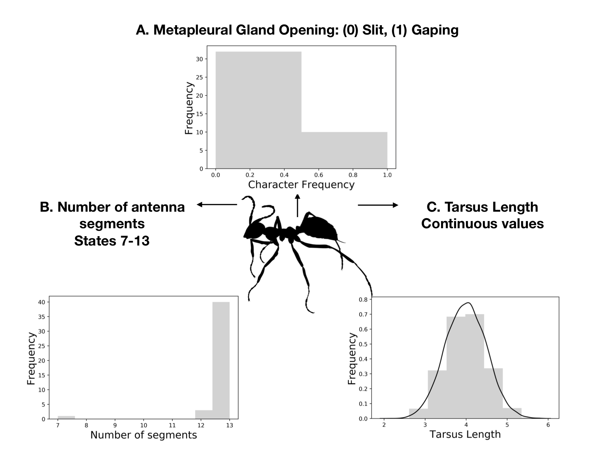

- We typically don't collect invarient characters!  
- Wagner (2009) and Harisson and Larson (2016) have argued that the Gamma is not appropriate for ASRV in morphological data, and we should use a lognormal

Engaging with underlying assumptions
========================================================


```r
library(dplyr)
library(ggplot2)
dat <- data.frame(draws = c(rlnorm(n = 100, mean=1)))

d2 <- dat %>%  summarize(lower = quantile(dat$draws, probs = .25), middle = quantile(dat$draws, probs = .5), seventyfive = quantile(dat$draws, probs = .75), upper = quantile(dat$draws, probs = .99))

ggplot(dat, aes(x=draws)) + geom_density() + geom_vline(data = d2, aes(xintercept = lower)) + geom_vline(data = d2, aes(xintercept = middle)) +geom_vline(data = d2, aes(xintercept = seventyfive)) +geom_vline(data = d2, aes(xintercept = upper)) 
```


Engaging with underlying assumptions
========================================================

- In previous iterations of software, you might have to email a developer and ask them to implement something 
- RevBayes' graphical model framework emphasizes flexibility. We can simply plug in another ASRV distribution.

Engaging with underlying assumptions
========================================================

Open RB_Discrete_Morphology_Model_test.md


Engaging with underlying assumptions
========================================================

RevBayes can't be run from within RStudio. In our console, type: 

```r
library(knitr)
purl("RB_MCMC_Discrete_Morph.Rmd")
```
This will generate a RB_MCMC_Discrete_Morph.R file with our Rev code.

Engaging with underlying assumptions
========================================================

Move the RB_MCMC_Discrete_Morph.R file to scripts, and execute like so:

```
rb scripts/RB_MCMC_Discrete_Morph.R
```
This will take about 7 minutes.

Engaging with underlying assumptions
========================================================

Return to RB_MCMC_Discrete_Morph.md and scroll to Lognormally-distributed among-character rate variation.

Follow the instructions in the file.

Engaging with underlying assumptions
========================================================


Engaging with underlying assumptions
========================================================


Engaging with underlying assumptions
========================================================

- Maybe there is an effect here
- But, the larger point is that *flexibility enabled by modularity means that we were able to immediately implement a model we were interested in*

Transparency and documentation
========================================================

It wouldn't be unfair to say there are some things about RevBayes that are more complex than other phylogenetic softwares

Transparency and documentation
========================================================


Transparency and documentation
========================================================


Each one is available as a markdown file on the [website repository](https://github.com/revbayes/revbayes.github.io)

Transparency and documentation
========================================================

You see an analysis you like? Clone it!

Transparency and documentation
========================================================

Integrate with various other R packages, like Bookdown, to generate a flexible living textbook for your systematics class!

```r
bookdown::render_book("RB_MCMC_Discrete_Morph.Rmd", "bookdown::gitbook")
```

Transparency and documentation
========================================================

We also have the RevKernel, and a set of RevNotebooks ready to go for the Pythonistas.
