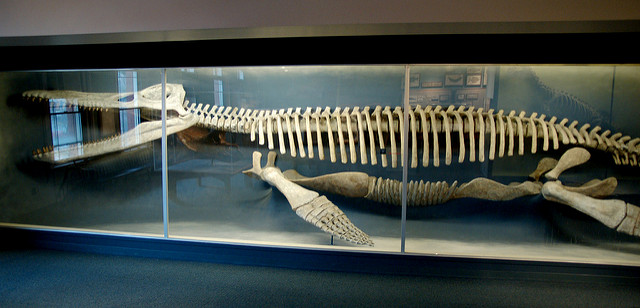
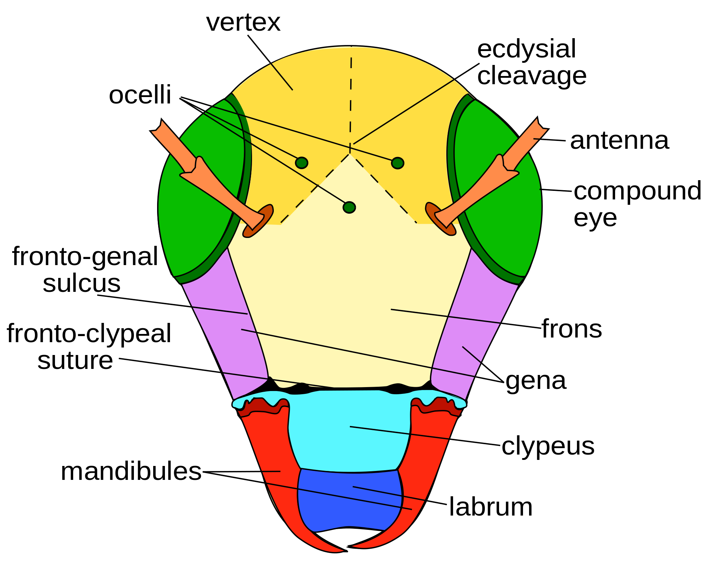
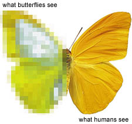
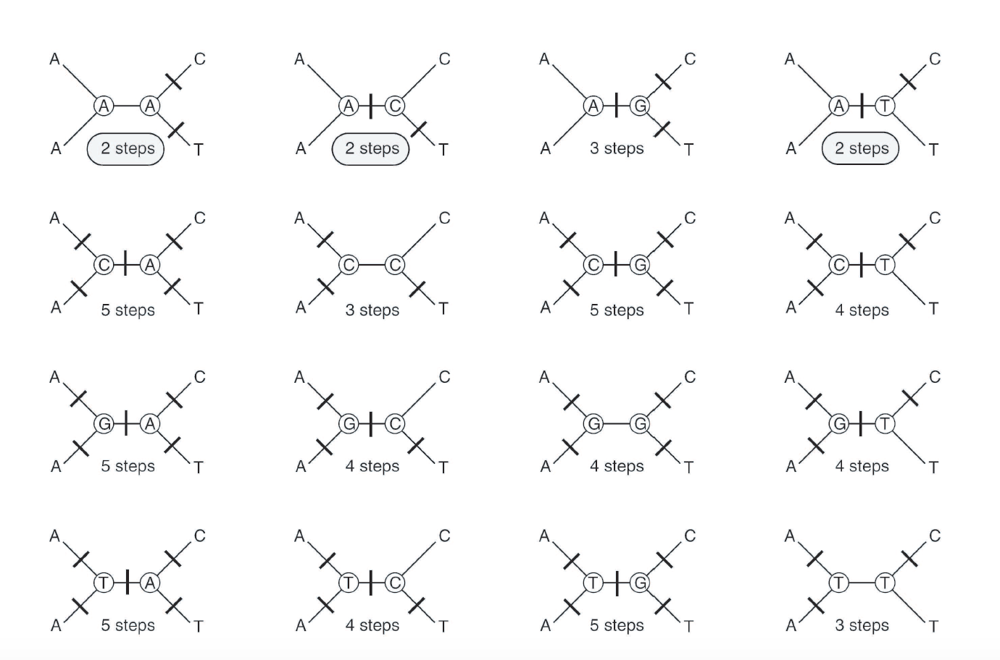

## Good Morning!


- What is a tree?
- How is a tree built?
- What are phylogenetic data?

## What do we do with a phylogeny?

- Determine the timing of trait evolution


Skink tree from Wright et al. 2015

## What do we do with a phylogeny?

- Tell homology from convergence



Dolphin, Alex Vasenin via WikiMedia


## What do we do with a phylogeny?

- Trace the origins of structures
 

Ask a Biologist illustration of homology


## What do we do with a phylogeny?

- Taxonomy


- Hennig, 1950 Grundzüge einer Theorie der Phylogenetischen Systematik
  - Taxonomy should be logically consistent with the tree for the group

## What do we do with a phylogeny?

- Taxonomy


- Hennig, 1950 Grundzüge einer Theorie der Phylogenetischen Systematik
  - Taxonomy should be logically consistent with the tree for the group
- Sneath & Sokal, 1963, 1973
  - Using distance matrices to cluster based on phenetic similarity

## Tree Terms: Tip


```{r}
library(phytools)
tree <- pbtree(n = 5)
plot(tree, cex = 3.5, no.margin = TRUE, edge.width = 1.5)
```


Tip: What we are putting on the tree. May be species, individuals, or higher-order taxa.
May be called terminal node, leaf, one degree node.


## Tree Terms: Tip


```{r}
plot(tree, cex = 3.5, no.margin = TRUE, edge.width = 1.5)
```


```{r}
tree$tip.label
```

```
[1] "t4" "t5" "t1" "t2" "t3"
```
Access in R: tree$tip.label

## Tree Terms: Node


```{r}
plot(tree, cex = 3.5, no.margin = TRUE, edge.width = 1.5)
nodelabels(cex=4)
```


Node: Where nodes meet, implying a most recent common ancestor.
May be called vertex, or three-degree node.

## Tree Terms: Node


```{r}
library(ape)
tree$Nnode
```

```
[1] 4
```

```{r}
getMRCA(tree, c("t1", "t2"))
```

```
[1] 6
```

  
## Tree Terms: branch


```r
#plot(tree, cex = 3.5, no.margin = TRUE, edge.width = 1.5)
tree$edge
```

```
     [,1] [,2]
[1,]    6    7
[2,]    7    8
[3,]    8    1
[4,]    8    2
[5,]    7    3
[6,]    6    9
[7,]    9    4
[8,]    9    5
```
Branch: What connects the tip to the tree. Can have a variety of units, which we will discuss over the next few days.
May be called edge. 
Access in R: tree$edge


## Tree Terms: branch


```{r}
library(phytools)
plotBranchbyTrait(tree,tree$edge.length,method="tips")
```


```{r}
tree$edge.length
```

```
[1] 0.01070042 1.00622147 0.36177554 0.36177554 1.36799701 0.23368315
[7] 1.14501427 1.14501427
```


## Tree Terms


```{r}
plot(tree, cex = 3.5, no.margin = TRUE, edge.width = 1.5, direction = "downwards")
```


## Tree Terms


```{r}
plot(tree, cex = 3.5, no.margin = TRUE, edge.width = 1.5, type="fan")
```


## Tree Terms: Rotation - reflecting taxa at a node


```{r}
plot(tree, cex = 3.5, no.margin = TRUE, edge.width = 1.5)
nodelabels(cex = 3.5)
```


```{r}
rotateNodes(tree, c(7, 8))
```

```

Phylogenetic tree with 5 tips and 4 internal nodes.

Tip labels:
[1] "t1" "t5" "t4" "t2" "t3"

Rooted; includes branch lengths.
```

```{r}
plot(tree, cex = 3.5, no.margin = TRUE, edge.width = 1.5)
```


## Tree Terms: Monophyletic - an ancestor and all its descendents


```{r}
is.monophyletic(tree, c("t1", "t2"), plot = TRUE, edge.width = 1.5, cex = 3.5, no.margin = TRUE)
```


```
[1] FALSE
```

## Tree Terms: Rooting


```{r}
# reroot(tree, node.number)
plot(tree, cex = 3.5, no.margin = TRUE, edge.width = 1.5)
```


Ingroup: Taxa of interest 

Outgroup: Taxon closely related used to root the tree

## Tree Terms: Rooting


```{r}
unroot_tree <- unroot(tree)
plot(unroot_tree, cex = 3.5, no.margin = TRUE, edge.width = 1.5)
```


## How is a tree built?


- Many ways. We will focus on three:
  - Maximum parsimony
  - Maximum likelihood
  - Bayesian inference

## Phylogenetic Data


```{r}
library(alignfigR)
char_data <- read_alignment("../../data/bears_fasta.fa")
char_data[1:3]
```

```
$Agriarctos_spp
 [1] "?" "0" "?" "?" "?" "?" "?" "?" "?" "?" "?" "?" "?" "?" "?" "?" "0"
[18] "0" "0" "1" "1" "1" "1" "0" "0" "1" "?" "1" "1" "?" "0" "1" "1" "1"
[35] "1" "0" "1" "1" "0" "?" "?" "0" "1" "1" "1" "0" "?" "?" "?" "?" "?"
[52] "?" "?" "?" "?" "?" "?" "?" "?" "?" "?" "?"

$Ailurarctos_lufengensis
 [1] "?" "0" "?" "?" "?" "?" "?" "?" "?" "?" "?" "?" "?" "?" "?" "?" "?"
[18] "0" "0" "1" "1" "1" "1" "0" "1" "1" "?" "1" "1" "?" "0" "?" "?" "?"
[35] "?" "0" "1" "1" "1" "?" "0" "0" "1" "1" "1" "0" "1" "0" "1" "1" "0"
[52] "1" "1" "?" "?" "?" "?" "?" "?" "?" "?" "?"

$Ailuropoda_melanoleuca
 [1] "1" "0" "1" "1" "1" "1" "0" "1" "1" "0" "1" "0" "0" "1" "0" "0" "0"
[18] "0" "0" "1" "1" "1" "1" "0" "1" "0" "1" "1" "1" "0" "0" "1" "0" "1"
[35] "0" "0" "1" "1" "0" "0" "0" "0" "1" "1" "1" "0" "1" "0" "0" "1" "0"
[52] "1" "1" "0" "0" "0" "1" "0" "0" "0" "1" "0"
```

## Phylogenetic Data


```{r}
library(alignfigR)
char_data <- read_alignment("../../data/bears_fasta.fa")
char_data[1:3]
```

```
$Agriarctos_spp
 [1] "?" "0" "?" "?" "?" "?" "?" "?" "?" "?" "?" "?" "?" "?" "?" "?" "0"
[18] "0" "0" "1" "1" "1" "1" "0" "0" "1" "?" "1" "1" "?" "0" "1" "1" "1"
[35] "1" "0" "1" "1" "0" "?" "?" "0" "1" "1" "1" "0" "?" "?" "?" "?" "?"
[52] "?" "?" "?" "?" "?" "?" "?" "?" "?" "?" "?"

$Ailurarctos_lufengensis
 [1] "?" "0" "?" "?" "?" "?" "?" "?" "?" "?" "?" "?" "?" "?" "?" "?" "?"
[18] "0" "0" "1" "1" "1" "1" "0" "1" "1" "?" "1" "1" "?" "0" "?" "?" "?"
[35] "?" "0" "1" "1" "1" "?" "0" "0" "1" "1" "1" "0" "1" "0" "1" "1" "0"
[52] "1" "1" "?" "?" "?" "?" "?" "?" "?" "?" "?"

$Ailuropoda_melanoleuca
 [1] "1" "0" "1" "1" "1" "1" "0" "1" "1" "0" "1" "0" "0" "1" "0" "0" "0"
[18] "0" "0" "1" "1" "1" "1" "0" "1" "0" "1" "1" "1" "0" "0" "1" "0" "1"
[35] "0" "0" "1" "1" "0" "0" "0" "0" "1" "1" "1" "0" "1" "0" "0" "1" "0"
[52] "1" "1" "0" "0" "0" "1" "0" "0" "0" "1" "0"
```
These data are binary

## Phylogenetic Data


```{r}
library(alignfigR)
char_data <- read_alignment("../../data/bears_fasta.fa")
char_data[1:3]
```

```
$Agriarctos_spp
 [1] "?" "0" "?" "?" "?" "?" "?" "?" "?" "?" "?" "?" "?" "?" "?" "?" "0"
[18] "0" "0" "1" "1" "1" "1" "0" "0" "1" "?" "1" "1" "?" "0" "1" "1" "1"
[35] "1" "0" "1" "1" "0" "?" "?" "0" "1" "1" "1" "0" "?" "?" "?" "?" "?"
[52] "?" "?" "?" "?" "?" "?" "?" "?" "?" "?" "?"

$Ailurarctos_lufengensis
 [1] "?" "0" "?" "?" "?" "?" "?" "?" "?" "?" "?" "?" "?" "?" "?" "?" "?"
[18] "0" "0" "1" "1" "1" "1" "0" "1" "1" "?" "1" "1" "?" "0" "?" "?" "?"
[35] "?" "0" "1" "1" "1" "?" "0" "0" "1" "1" "1" "0" "1" "0" "1" "1" "0"
[52] "1" "1" "?" "?" "?" "?" "?" "?" "?" "?" "?"

$Ailuropoda_melanoleuca
 [1] "1" "0" "1" "1" "1" "1" "0" "1" "1" "0" "1" "0" "0" "1" "0" "0" "0"
[18] "0" "0" "1" "1" "1" "1" "0" "1" "0" "1" "1" "1" "0" "0" "1" "0" "1"
[35] "0" "0" "1" "1" "0" "0" "0" "0" "1" "1" "1" "0" "1" "0" "0" "1" "0"
[52] "1" "1" "0" "0" "0" "1" "0" "0" "0" "1" "0"
```
Always arranged with rows being taxa and columns corresponding to a character - "matrix" structure

## Phylogenetic Data

Text editor - phylo data,  metadata

## Phylogenetic Data


## Phylogenetic Data


DNA data tends to be simple


## Phylogenetic Data


Example character from Brady: 

3. Worker, queen, and male. Specialized, stout setae on
anterior margin of clypeus: (0) absent; (1) present.
The presence of these specialized setae is a putative
synapomorphy of Amblyoponinae (Ward, 1994), including
Amblyopone and Onychomyrmex.



image via Ask a Biologist

## Phylogenetic Data


- How do we know we have a truly discrete state?


## Phylogenetic Data


How do we know we've captured the relevant character axes? 


image via Ask a biologist, Mike Hagelberg

## Phylogenetic Data


```{r}
library(ggplot2)
colors <- c("blue", "purple","white")
plot_alignment(char_data, colors, taxon_labels = TRUE) + theme(text = element_text(size=40))
```


## Phylogenetic Data


```{r}
library(ggplot2)
colors <- c("blue", "purple","white")
plot_alignment(char_data, colors, taxon_labels = TRUE) + theme(text = element_text(size=40))
```


How do we go from this to a tree?

## Parsimony


- Not only applied in phylogenetics
- The simplest explanation for the observed data is the best

## Parsimony

- Maximum parsimony: the tree that minimizes the number of "steps", or changes, on a tree is to be preferred
- Let's turn to the board for a minute: Parsimony informative, invariant, and parsimony non-informative variation

???
Have them start installs on the next page while we do this.

## treesiftr


RStudio --or--Shiny

## treesiftr


```{r}
library(treesiftr)
aln_path <- "../../data/bears_fasta.fa"
bears <- read_alignment(aln_path)
bear_tree <- multi2di(read.tree("../../data/starting_tree.tre"))
sample_df <- generate_sliding(bears, start_char = 1, stop_char = 5, steps = 1)
print(sample_df)
```

```
  starting_val stop_val step_val
1            1        2        1
2            2        3        1
3            3        4        1
4            4        5        1
5            5        6        1
```

## treesiftr


```{r}
library(phangorn)
library(ggtree)

output_vector <- generate_tree_vis(sample_df = sample_df,                                        alignment = aln_path, 
                                   tree = bear_tree, 
                                   phy_mat = bears,                                              pscore = TRUE)
```


## treesiftr


```{r}
output_vector #sample output - you will get more than this when you run in your console
```

## Parsimony: Many trees for one character and 4 taxa




Parsimony Trees

This is one character. Imagine many - enumeration is not possible.Also note that several trees have the same "best" tree

Image via Mark Holder


## Parsimony: How do we find the most parsimonious tree?


- We're going to take an exercise break and play with PAUP
  - http://phylosolutions.com/paup-test/
  - Download the command line executeable for your OS
  - Copy it into this repository
  - Open a terminal

## PAUP


```paup
execute data/bears_morphology.nex
```
- NOTE: PAUP allows tab-completion
- Open the bears_morphology file in a text editor. Now:


## PAUP: A couple important commands


```paup
cstatus
tstatus
showmatrix
showdist
log file="mylogfile"
```
- Try each of these - what information do they give you?


## PAUP: Building a tree


```paup
alltrees
```
What happened here?

## Parsimony: Enumeration is not possible for more than 12 taxa


Parsimony Trees


## PAUP: Heuristic Searches

Heuristic - use of shortcuts to reduce the number of trees we need to search

```paup
hsearch
```

- What is the name of the heuristic that was used?
- How was the initial tree discovered?
- How many trees were searched?
- How many "best" trees were there, and what is their score?

## PAUP: Heuristic Searches

Heuristic - use of shortcuts to reduce the number of trees we need to search

```paup
hsearch swap = nni
```

- How many trees were examined with this algorithm? Why is this number so much smaller?
- How many "best" trees were found, and what is their score?

## PAUP: Heuristic Searches

Heuristic - use of shortcuts to reduce the number of trees we need to search

```paup
hsearch swap = spr
```

- How many trees were examined with this algorithm?
- How many "best" trees were found, and what is their score?
- When would we expect searching algorithm to matter strongly?

## PAUP: Exporting parsimony trees


```paup
savetrees from=1 to=1 file=results/tree1.tre;
savetrees from=2 to=2 file=results/tree2.tre;
savetrees from=3 to=3 file=results/tree3.tre;

```


